# 🏗️ System Architecture

This document provides a comprehensive overview of the PDF Object Overlay System architecture, design principles, and implementation details.

---

## 📋 Table of Contents

1. [Overview](#overview)
2. [System Design Principles](#system-design-principles)
3. [Architecture Layers](#architecture-layers)
4. [Component Interactions](#component-interactions)
5. [Data Flow](#data-flow)
6. [Key Subsystems](#key-subsystems)
7. [Technology Stack](#technology-stack)
8. [Design Patterns](#design-patterns)

---

## 🎯 Overview

The PDF Object Overlay System is a multi-layered application that transforms XML documents into PDFs with precise element coordinate extraction. The system enables interactive visualization and manipulation of PDF content through a web interface.

### Core Capabilities
- **XML to PDF Conversion**: Transform structured XML into formatted PDFs
- **Coordinate Extraction**: Extract precise element positions from PDFs
- **Interactive Overlays**: Visualize and interact with PDF elements
- **Real-time Processing**: Live updates via WebSocket communication
- **Template-Based Transformation**: Flexible XML transformation using templates

---

## 🎨 System Design Principles

### 1. **Separation of Concerns**
- **Presentation Layer**: UI components (React/Vanilla JS)
- **Application Layer**: Server logic and API
- **Business Logic**: Core transformation engine
- **Data Layer**: File system and generated artifacts

### 2. **Modularity**
- Independent, reusable modules
- Clear module responsibilities
- Loose coupling between components
- High cohesion within modules

### 3. **Extensibility**
- Plugin-based template system
- Configurable transformation rules
- Extensible instruction processing
- Schema-agnostic XML processing

### 4. **Reliability**
- 3-pass LaTeX compilation for accuracy
- Robust error handling
- File watching for auto-regeneration
- Comprehensive logging

### 5. **Performance**
- Asynchronous operations
- Streaming where possible
- Caching of intermediate results
- Parallel processing where applicable

---

## 🏛️ Architecture Layers

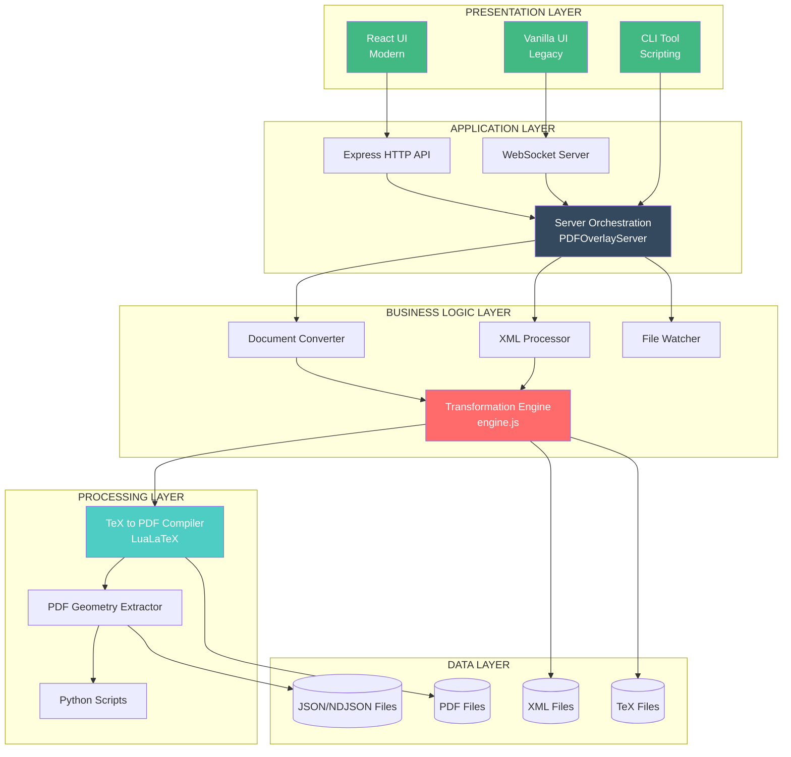

---

## 🔄 Component Interactions

### 1. **User Initiates PDF Generation**

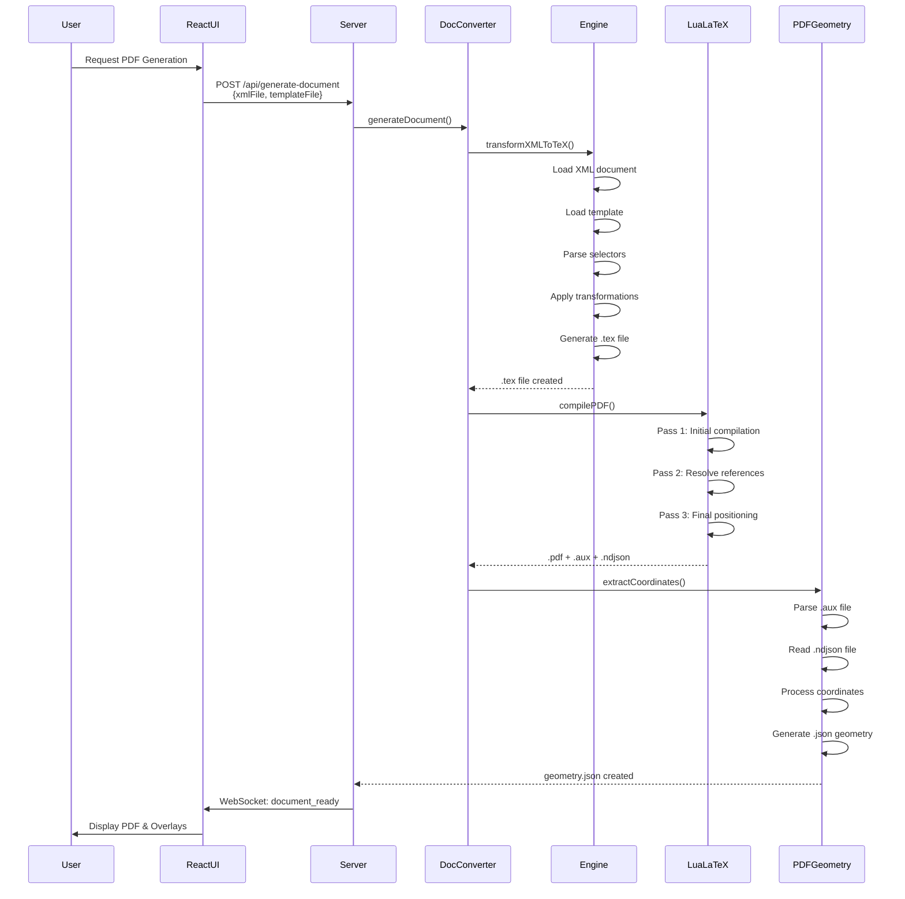

### 2. **User Applies Instruction (e.g., Move Figure)**

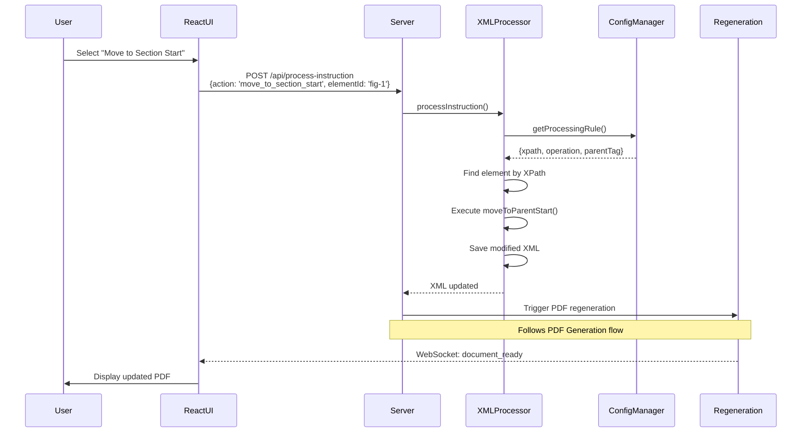

### 3. **File Watcher Detects Change**

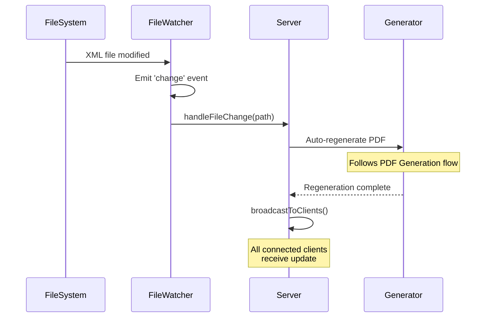

---

## 📊 Data Flow

### XML → PDF Transformation Flow

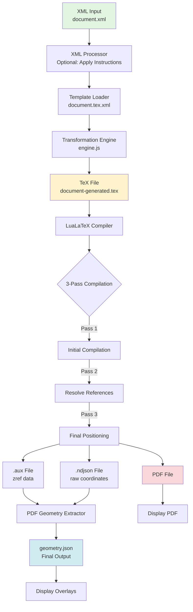

### Coordinate Extraction Pipeline

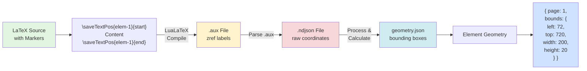

---

## 🔑 Key Subsystems

### 1. **Template Engine (engine.js)**

**Purpose**: Transform XML to TeX using declarative templates

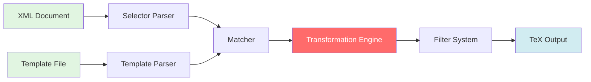

**Key Components**:
- **Selector Parser**: CSS-like selectors for XML matching
- **Template Parser**: Parse template placeholders and filters
- **Transformation Engine**: Apply templates recursively
- **Filter System**: Transform text (escape, format, etc.)

**Example**:
```xml
<!-- Template -->
<template match="title">
  <tex-cmd name="section">[[./text()]]</tex-cmd>
</template>

<!-- XML -->
<title>Introduction</title>

<!-- Output TeX -->
\section{Introduction}
```

### 2. **Coordinate System (pdf-geometry.js)**

**Purpose**: Extract precise element positions from compiled PDFs

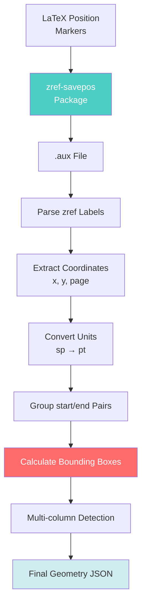

**Key Features**:
- Uses `zref-savepos` for LaTeX position marking
- Parses `.aux` file for coordinate data
- Processes NDJSON format
- Calculates bounding boxes
- Handles multi-page and multi-column layouts

**Coordinate Format**:
```json
{
  "elementId": {
    "page": 1,
    "bounds": {
      "left": 72.0,
      "top": 720.0,
      "width": 200.0,
      "height": 20.0
    },
    "type": "paragraph"
  }
}
```

### 3. **Instruction Processing (XMLProcessor.js)**

**Purpose**: Apply user instructions to modify XML documents

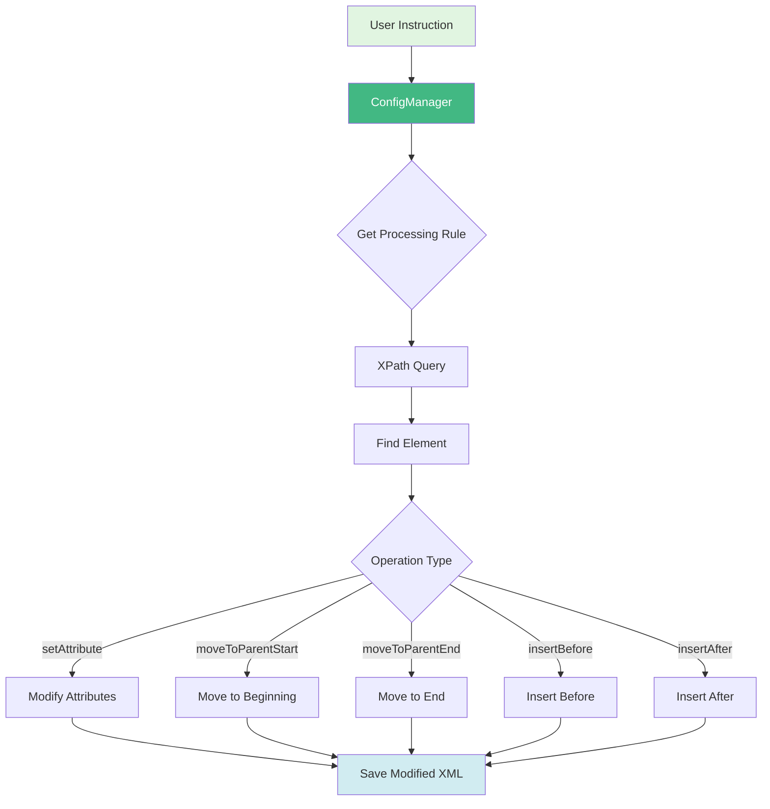

**Operations**:
- `setAttribute`: Modify element attributes
- `moveToParentStart`: Move element to beginning of parent
- `moveToParentEnd`: Move element to end of parent
- `insertBefore`: Insert before another element
- `insertAfter`: Insert after another element

**Configuration-Driven**:
```json
{
  "figure": {
    "move_to_section_start": {
      "xpath": "//figure[@id='{elementId}']",
      "operation": "moveToParentStart",
      "parentTag": "section"
    }
  }
}
```

### 4. **WebSocket Communication**

**Purpose**: Real-time updates between server and clients

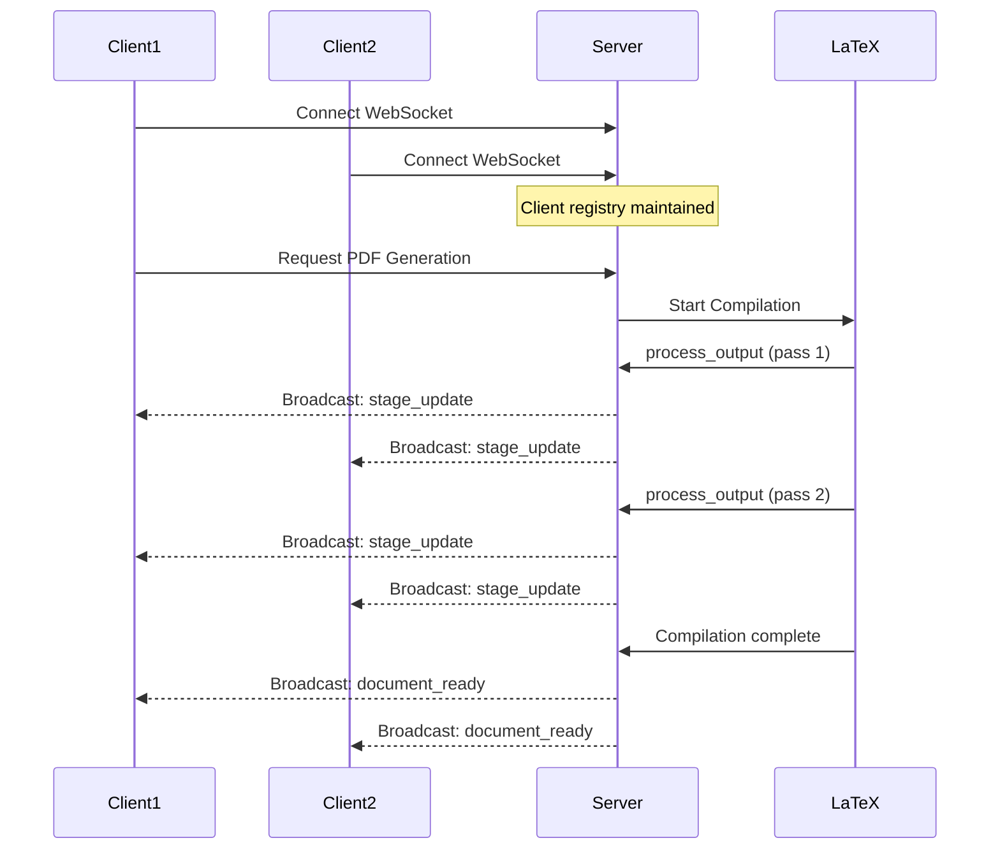

**Message Types**:
- `process_output`: LaTeX compilation progress
- `stage_update`: Processing stage changes
- `document_ready`: PDF generation complete
- `error`: Error notifications

**Example Message**:
```json
{
  "type": "stage_update",
  "stage": "compiling",
  "message": "Compiling LaTeX (pass 2/3)...",
  "timestamp": "2025-11-03T12:00:00.000Z"
}
```

---

## 🛠️ Technology Stack

### Backend
| Technology | Purpose | Version |
|------------|---------|---------|
| Node.js | Runtime environment | >= 12.0.0 |
| Express | HTTP server & routing | ^4.18.2 |
| WebSocket (ws) | Real-time communication | ^8.14.2 |
| xmldom | XML parsing/manipulation | ^0.6.0 |
| xpath | XML querying | ^0.0.32 |
| peggy | Parser generator | ^1.2.0 |
| chokidar | File system watching | ^3.5.3 |
| fs-extra | Enhanced file operations | ^11.1.1 |

### Frontend
| Technology | Purpose | Version |
|------------|---------|---------|
| React | UI framework (modern) | ^18.2.0 |
| React DOM | React rendering | ^18.2.0 |
| Vite | Build tool | Latest |
| Vanilla JS | Legacy UI | ES6+ |

### Document Processing
| Technology | Purpose | Version |
|------------|---------|---------|
| LuaLaTeX | PDF generation | TeX Live 2023+ |
| zref-savepos | Coordinate marking | LaTeX package |
| Python 3 | Helper scripts | >= 3.7 |

---

## 🎯 Design Patterns

### 1. **Event-Driven Architecture**

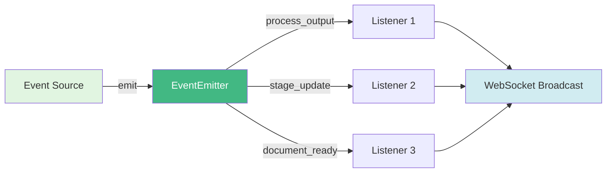

- EventEmitter for process events
- WebSocket for client updates
- File watcher for auto-regeneration

```javascript
// Event emission
this.processEmitter.emit('process_output', {
  type: 'stdout',
  message: 'Compiling...'
});

// Event listening
this.processEmitter.on('process_output', (data) => {
  this.broadcastToClients(data);
});
```

### 2. **Strategy Pattern**
- Different XML processing operations
- Configurable transformation rules
- Schema-specific adaptations

```javascript
// Operation selection
const operation = config.xmlProcessingRules[elementType][action];
switch (operation.operation) {
  case 'setAttribute': return this.setAttribute(...);
  case 'moveToParentStart': return this.moveToParentStart(...);
  // ...
}
```

### 3. **Template Method Pattern**
- PDF generation workflow
- 3-pass compilation process
- Consistent error handling

```javascript
async generateDocument() {
  try {
    await this.validateInputs();
    await this.transformXMLToTeX();
    await this.compilePDF();
    await this.extractCoordinates();
    await this.notifyClients();
  } catch (error) {
    await this.handleError(error);
  }
}
```

### 4. **Observer Pattern**

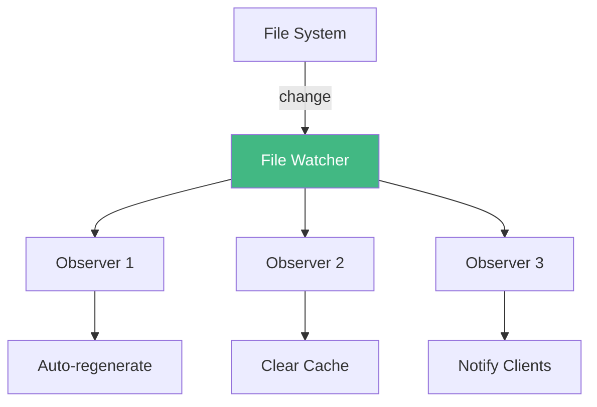

- File system monitoring
- Client subscriptions
- Real-time updates

```javascript
// File watching
this.watcher.on('change', (path) => {
  this.handleFileChange(path);
});

// Client subscriptions
this.clients.forEach(client => {
  client.send(JSON.stringify(message));
});
```

### 5. **Facade Pattern**
- ConfigManager abstracts config complexity
- DocumentConverter provides simple interface
- Server orchestrates complex workflows

```javascript
// Simple public interface
class DocumentConverter {
  async generateDocument(xmlFile, templateFile) {
    // Complex internal steps hidden
  }
}
```

---

## 📈 Scalability Considerations

### Current Limitations
- Single-threaded LaTeX compilation
- In-memory XML processing
- Local file system dependency

### Future Improvements
- Worker threads for parallel compilation
- Stream processing for large files
- Database for metadata storage
- Distributed processing queue
- Caching layer for frequently used templates

---

## 🔐 Security Considerations

### Input Validation
- Validate all file paths
- Sanitize XML input
- Restrict LaTeX commands

### Sandboxing
- Run LaTeX in restricted environment
- Limit file system access
- Timeout long-running processes

### Authentication
- WebSocket authentication (future)
- API key validation (future)
- Rate limiting (future)

---

## 📚 Further Reading

- [Module Documentation](./modules/) - Detailed module APIs
- [Workflow Documentation](./workflows/) - Process flows
- [API Documentation](./api/) - HTTP/WebSocket APIs

---

**Last Updated**: November 3, 2025
