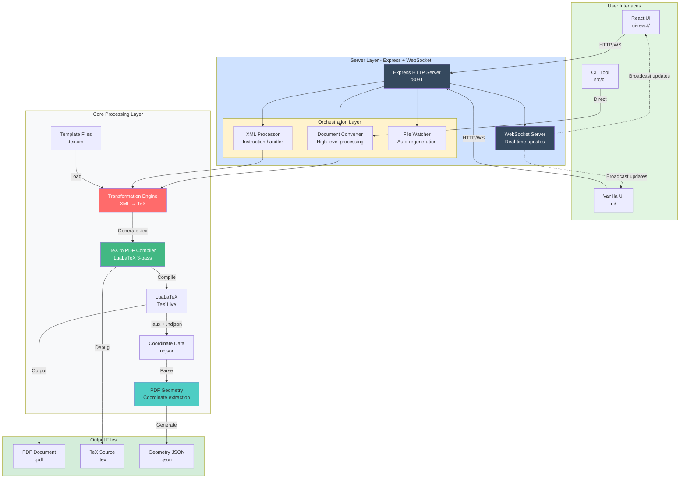

# 🛠️ Application Developer Documentation

Welcome to the **PDF Object Overlay System** application developer documentation! This guide will help you understand the system architecture, develop new features, and extend the application.

---

## 📚 Application Developer Documentation Structure

This documentation covers the **PDF Object Overlay System** - the XML to PDF conversion application with coordinate extraction.

```
dev-docs/
├── README.md                          # This file - Application dev guide
├── ARCHITECTURE.md                    # System architecture (XML→PDF pipeline)
├── GETTING-STARTED.md                 # Development environment setup
├── CONTRIBUTING.md                    # Contributing guidelines
│
├── modules/                           # Core Module Documentation
│   ├── ENGINE.md                     ✅ XML→TeX transformation engine
│   ├── SERVER.md                     # WebSocket server & API
│   ├── PDF-GEOMETRY.md               # Coordinate extraction system
│   ├── TEX-TO-PDF.md                 # LaTeX compilation
│   ├── DOCUMENT-CONVERTER.md         # High-level document processing
│   ├── XML-PROCESSOR.md              # XML manipulation & instructions
│   ├── CONFIG-MANAGER.md             # Configuration management
│   └── FILE-WATCHER.md               # Auto-regeneration system
│
├── workflows/                         # Application Workflows
│   ├── XML-TO-PDF-PIPELINE.md        # Complete generation pipeline
│   ├── COORDINATE-EXTRACTION.md      # How coordinates are extracted
│   ├── INSTRUCTION-PROCESSING.md     # Processing user instructions
│   └── TEMPLATE-SYSTEM.md            # How templates work
│
├── features/                         # Feature Documentation
│   ├── VERSION-CONTROL.md            # Document version management
│   └── DYNAMIC-SCHEMA-DETECTION.md   # Automatic XML schema adaptation
│
├── api/                              # API Documentation
│   ├── REST-API.md                   # HTTP REST endpoints
│   ├── WEBSOCKET-API.md              # WebSocket protocol
│   └── SERVER-CONFIG.md              # server-config.json reference
│
└── guides/                           # Developer Guides
    ├── ADDING-NEW-INSTRUCTIONS.md    # How to add XML instructions
    ├── CREATING-TEMPLATES.md         # How to create LaTeX templates
    ├── EXTENDING-ENGINE.md           # How to extend transformation engine
    └── COORDINATE-SYSTEM.md          # Understanding coordinates
```

---

## 🎯 Quick Start for Application Developers

### 1. **Understanding the Application**
The PDF Object Overlay System transforms XML documents into PDFs with precise coordinate data:
- [Architecture Overview](./ARCHITECTURE.md) - XML→PDF pipeline design
- [Engine Module](./modules/ENGINE.md) - How XML is transformed to TeX
- Core workflow: `XML Input → Template → TeX → LuaLaTeX → PDF + Coordinates`

### 2. **Setting Up Development Environment**
Get your development environment ready:
- [Getting Started](./GETTING-STARTED.md) - Complete setup guide
- Install: Node.js, LuaLaTeX
- Run the server: `npm run server`
- Run React UI: `npm run dev:react`

### 3. **Understanding Core Application Modules**
Learn about the key application components:
- [Engine Module](./modules/ENGINE.md) ✅ - XML→TeX transformation (template-based)
- [Server Module](./modules/SERVER.md) - WebSocket server & HTTP API
- [PDF Geometry](./modules/PDF-GEOMETRY.md) - Coordinate extraction from PDFs
- [TeX to PDF](./modules/TEX-TO-PDF.md) - LaTeX compilation (3-pass)
- [XML Processor](./modules/XML-PROCESSOR.md) - Processing user instructions
- [Document Converter](./modules/DOCUMENT-CONVERTER.md) - High-level orchestration
- [Version Control](./features/VERSION-CONTROL.md) ✅ - Document version management & history
- [Dynamic Schema Detection](./features/DYNAMIC-SCHEMA-DETECTION.md) ✅ - Automatic XML schema adaptation

### 4. **Common Development Tasks**
Learn how to extend the application:
- **Add New XML Instruction**: Modify `server-config.json` + `XMLProcessor.js`
- **Create New Template**: Use template syntax in `.tex.xml` files
- **Add Coordinate Markers**: Use `\saveTextPos` in LaTeX
- **Extend Engine**: Add filters or template elements in `engine.js`

### 5. **Understanding Application Workflows**
- **XML to PDF Generation**: XML → Engine → TeX → LuaLaTeX → PDF
- **Coordinate Extraction**: LaTeX markers → .aux file → NDJSON → JSON
- **Instruction Processing**: User action → XML modification → Regenerate PDF → Save Version
- **Version Control**: Auto-save versions → Navigate history → Restore previous versions
- **Real-time Updates**: Process events → WebSocket → Client updates

---

## 🏗️ System Architecture at a Glance



**Key Components:**
- **User Interfaces**: Multiple clients (React, Vanilla JS, CLI) connect to the server
- **Server Layer**: Express HTTP + WebSocket for real-time updates
- **Orchestration**: Document Converter, XML Processor, File Watcher coordinate workflows
- **Processing**: Engine transforms XML→TeX, LaTeX compiles to PDF, coordinates extracted
- **Output**: PDF document with geometry data for interactive overlays

---

## 🔑 Key Concepts

### 1. **XML to PDF Pipeline**
The system transforms XML documents into PDFs through multiple stages:
```
XML Input → Template Selection → TeX Generation → LaTeX Compilation → PDF + Coordinates
```

### 2. **Coordinate Extraction**
Uses `zref-savepos` in LaTeX to capture precise element positions:
```
LaTeX Markers → .aux File → Parse → NDJSON → JSON Geometry
```

### 3. **Three-Pass Compilation**
LaTeX is compiled three times to ensure accuracy:
- **Pass 1**: Initial compilation, creates `.aux` file
- **Pass 2**: Resolves references and floats
- **Pass 3**: Final positioning (ensures float coordinates are accurate)

### 4. **WebSocket Real-Time Updates**
Server broadcasts progress to clients in real-time:
```
Process Event → Event Emitter → WebSocket Server → All Clients
```

---

## 📦 Core Technologies

### Backend
- **Node.js** (>=12.0.0) - Runtime environment
- **Express** - HTTP server and API
- **WebSocket** (ws) - Real-time communication
- **xmldom** - XML parsing and manipulation
- **xpath** - XML querying
- **peggy** - Parser generation for templates
- **chokidar** - File system watching

### Frontend
- **React 18** - Modern UI (ui-react)
- **Vanilla JavaScript** - Legacy UI (ui)
- **Vite** - Build tool for React
- **WebSocket** - Server communication

### Document Processing
- **LuaLaTeX** - PDF generation
- **zref-savepos** - Coordinate marking

---

## 🚀 Development Workflows

### Running the Development Server
```bash
# Terminal 1: Start backend server
npm run server

# Terminal 2: Start React development server
npm run dev:react

# Access:
# - Backend: http://localhost:8081
# - React UI: http://localhost:5173
# - Vanilla UI: http://localhost:8081/ui/
```

### Generating a PDF from XML
```bash
# Using CLI
node src/cli.js --input xml/document.xml --template template/document.tex.xml

# Using server (via UI or API)
# POST /api/generate-document
```

### Running Tests
```bash
# Test engine
npm run test-engine

# Test CLI
npm run test:cli

# Test figure placement
node scripts/validate-figure-placement.js
```

---

## 📖 Module Responsibilities

| Module | Responsibility | File |
|--------|---------------|------|
| **Server** | HTTP/WebSocket server, API endpoints | `server/server.js` |
| **Engine** | XML → TeX transformation | `src/engine.js` |
| **PDF Geometry** | Coordinate extraction from PDF | `src/pdf-geometry.js` |
| **TeX to PDF** | LaTeX compilation | `src/tex-to-pdf.js` |
| **Document Converter** | High-level document processing | `server/modules/DocumentConverter.js` |
| **XML Processor** | XML manipulation (instructions) | `server/modules/XMLProcessor.js` |
| **Config Manager** | Configuration management | `server/modules/ConfigManager.js` |
| **File Watcher** | Monitor file changes | `server/modules/FileWatcher.js` |
| **Version Manager** | Document version control & history | `server/modules/VersionManager.js` |

---

## 🔧 Common Development Tasks

### Adding a New XML Instruction
1. Define instruction in `server-config.json`
2. Implement processing logic in `XMLProcessor.js`
3. Add UI controls in React components
4. Test with sample XML

See: [Instruction Processing Workflow](./workflows/INSTRUCTION-PROCESSING.md)

### Modifying the Template System
1. Update template grammar in `engine.js`
2. Modify template parser
3. Update template files (`.tex.xml`)
4. Test transformation

See: [Engine Module Documentation](./modules/ENGINE.md)

### Adding Coordinate Features
1. Add LaTeX markers in `geom-marks.tex`
2. Update coordinate extraction in `pdf-geometry.js`
3. Update UI to display new data

See: [Coordinate System](./architecture/COORDINATE-SYSTEM.md)

---

## 🐛 Debugging Tips

### Enable Verbose Logging
```javascript
// In server.js or any module
console.log('🔍 Debug:', data);
```

### Check LaTeX Compilation
```bash
# View LaTeX log
cat TeX/document-generated.log

# Check generated TeX
cat TeX/document-generated.tex
```

### Inspect Coordinate Data
```bash
# View raw coordinate data
cat TeX/document-generated-texpos.ndjson

# View processed geometry
cat TeX/document-generated-geometry.json | jq
```

### WebSocket Debugging
```javascript
// In browser console
ws = new WebSocket('ws://localhost:8081');
ws.onmessage = (e) => console.log('WS:', e.data);
```

---

## 📊 Performance Considerations

### LaTeX Compilation
- **3-pass compilation** takes ~5-10 seconds
- Use file watcher to avoid unnecessary recompilation
- Cache intermediate results where possible

### Coordinate Extraction
- JavaScript processing is optimized for large documents
- Consider streaming NDJSON for huge files

### WebSocket Broadcasting
- Only broadcast to interested clients
- Throttle high-frequency updates
- Use compression for large payloads

---

## 🔐 Security Considerations

### File System Access
- Validate all file paths
- Sandbox LaTeX execution
- Limit file write permissions

### User Input
- Sanitize XML input
- Validate instruction parameters
- Prevent LaTeX injection

### WebSocket Security
- Implement authentication if needed
- Rate limit connections
- Validate message format

---

## 📚 Further Reading

### Internal Documentation
- [Architecture Deep Dive](./ARCHITECTURE.md)
- [API Reference](./api/)
- [Workflow Guides](./workflows/)

### External Resources
- [LuaLaTeX Documentation](http://www.luatex.org/)
- [zref Package](https://ctan.org/pkg/zref)
- [WebSocket Protocol](https://developer.mozilla.org/en-US/docs/Web/API/WebSockets_API)
- [Express.js Guide](https://expressjs.com/)

---

## 💬 Getting Help

### Internal Resources
- Check existing [bug fixes](../docs/bug-fixes/)
- Review [feature documentation](../docs/features/)
- Read [troubleshooting guides](../docs/coordinates/)

### External Help
- Open a GitHub issue
- Check the FAQ
- Contact the maintainers

---

## 🎯 Next Steps

1. **New to the project?** → Read [Getting Started](./GETTING-STARTED.md)
2. **Want to understand architecture?** → Read [Architecture Overview](./ARCHITECTURE.md)
3. **Ready to code?** → Read [Contributing Guide](./CONTRIBUTING.md)
4. **Need API docs?** → Check [API Reference](./api/)

---

**Happy Coding! 🚀**

*Last Updated: November 3, 2025*

