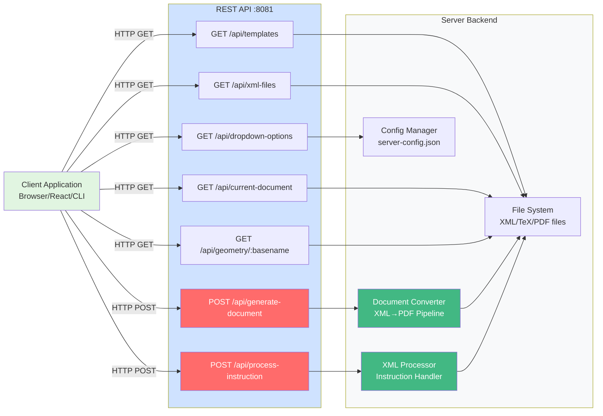
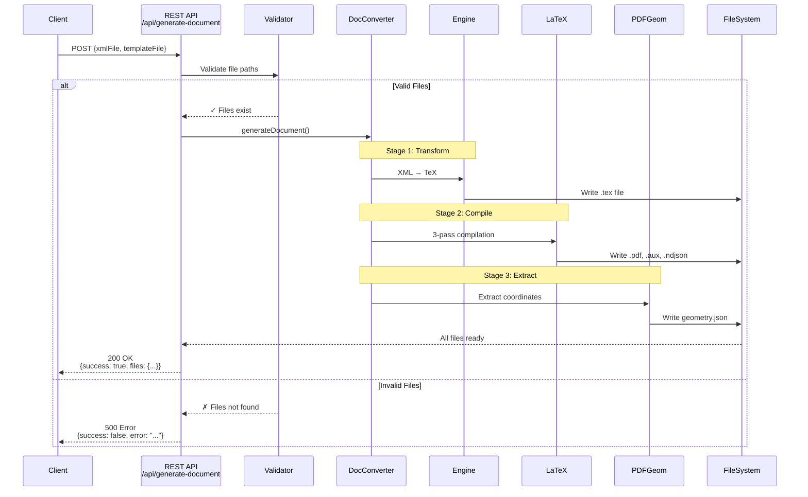

# 🌐 REST API Reference

Complete HTTP REST API reference for the PDF Object Overlay System server.

---

## 📋 Overview

**Base URL**: `http://localhost:8081`
**Protocol**: HTTP/1.1
**Format**: JSON
**CORS**: Enabled (all origins in development)

---

---

## 🏗️ System Architecture at a Glance



---

## 🔄 Document Generation Flow



---

## ✏️ Instruction Processing Flow

```mermaid
flowchart TD
    A[Client sends instruction<br/>POST /api/process-instruction] --> B{Validate Request}

    B -->|Invalid| C[400 Bad Request<br/>Invalid parameters]
    B -->|Valid| D[Load server-config.json]

    D --> E[Get processing rule<br/>for action + elementType]

    E --> F{Rule exists?}
    F -->|No| G[400 Bad Request<br/>Unknown action]
    F -->|Yes| H[XMLProcessor.processInstruction]

    H --> I[Load XML file]
    I --> J[Find element by XPath]

    J --> K{Element found?}
    K -->|No| L[400 Bad Request<br/>Element not found]
    K -->|Yes| M[Apply XML operation]

    M --> N{Operation type}
    N -->|setAttribute| O[Modify attributes]
    N -->|moveToParentStart| P[Move to section start]
    N -->|moveToParentEnd| Q[Move to section end]

    O --> R[Save modified XML]
    P --> R
    Q --> R

    R --> S[Trigger regeneration]
    S --> T[Auto-generate new PDF]

    T --> U[200 OK<br/>{success: true,<br/>regenerationTriggered: true}]

    style A fill:#e1f5e1
    style B fill:#fff3cd
    style H fill:#42b883,color:#fff
    style M fill:#ff6b6b,color:#fff
    style R fill:#4ecdc4
    style U fill:#d4edda
    style C fill:#f8d7da
    style G fill:#f8d7da
    style L fill:#f8d7da
```

---

## 🔑 Authentication

Currently no authentication required (development mode).

**Production Recommendation**: Add JWT or API key authentication.

---

## 📍 Endpoints

### GET `/api/templates`

Get list of available LaTeX templates.

**Response**: `200 OK`
```json
{
  "templates": [
    {
      "name": "document.tex.xml",
      "path": "template/document.tex.xml",
      "description": "Generic document template"
    },
    {
      "name": "ENDEND10921-sample-style.tex.xml",
      "path": "template/ENDEND10921-sample-style.tex.xml",
      "description": "Sample article style template"
    }
  ]
}
```

**Example**:
```bash
curl http://localhost:8081/api/templates
```

```javascript
// JavaScript
const response = await fetch('http://localhost:8081/api/templates');
const data = await response.json();
console.log(data.templates);
```

---

### GET `/api/xml-files`

Get list of available XML input files.

**Response**: `200 OK`
```json
{
  "xmlFiles": [
    {
      "name": "document.xml",
      "path": "xml/document.xml"
    },
    {
      "name": "ENDEND10921.xml",
      "path": "xml/ENDEND10921.xml"
    }
  ]
}
```

---

### POST `/api/generate-document`

Generate PDF from XML and template.

**Request Body**:
```json
{
  "xmlFile": "xml/document.xml",
  "templateFile": "template/document.tex.xml"
}
```

**Success Response**: `200 OK`
```json
{
  "success": true,
  "message": "Document generated successfully",
  "files": {
    "pdf": "TeX/document-generated.pdf",
    "tex": "TeX/document-generated.tex",
    "geometry": "TeX/document-generated-geometry.json",
    "texpos": "TeX/document-generated-texpos.ndjson"
  },
  "timestamp": "2025-11-03T12:00:00.000Z"
}
```

**Error Response**: `500 Internal Server Error`
```json
{
  "success": false,
  "error": "Document generation failed",
  "details": "XML file not found: xml/missing.xml",
  "timestamp": "2025-11-03T12:00:00.000Z"
}
```

**Example**:
```bash
curl -X POST http://localhost:8081/api/generate-document \
  -H "Content-Type: application/json" \
  -d '{
    "xmlFile": "xml/document.xml",
    "templateFile": "template/document.tex.xml"
  }'
```

```javascript
// JavaScript
const response = await fetch('http://localhost:8081/api/generate-document', {
    method: 'POST',
    headers: { 'Content-Type': 'application/json' },
    body: JSON.stringify({
        xmlFile: 'xml/document.xml',
        templateFile: 'template/document.tex.xml'
    })
});
const result = await response.json();
console.log(result.files.pdf);
```

---

### POST `/api/process-instruction`

Process a user instruction to modify XML.

**Request Body**:
```json
{
  "elementType": "figure",
  "action": "move_to_section_start",
  "elementId": "fig-1",
  "xmlFile": "xml/document.xml"
}
```

**Available Actions**:
- `move_bottom` - Move element to page bottom
- `move_top` - Move element to page top
- `move_to_section_start` - Move to section start (left column)
- `move_to_section_end` - Move to section end (right column)

**Success Response**: `200 OK`
```json
{
  "success": true,
  "message": "Instruction processed successfully",
  "action": "move_to_section_start",
  "elementId": "fig-1",
  "elementType": "figure",
  "xmlModified": true,
  "regenerationTriggered": true
}
```

**Error Response**: `400 Bad Request`
```json
{
  "success": false,
  "error": "Invalid instruction",
  "details": "Unknown action: invalid_action",
  "availableActions": ["move_bottom", "move_top", "move_to_section_start", "move_to_section_end"]
}
```

**Example**:
```bash
curl -X POST http://localhost:8081/api/process-instruction \
  -H "Content-Type: application/json" \
  -d '{
    "elementType": "figure",
    "action": "move_to_section_start",
    "elementId": "fig-1",
    "xmlFile": "xml/document.xml"
  }'
```

---

### GET `/api/dropdown-options`

Get dropdown options for UI (from server-config.json).

**Response**: `200 OK`
```json
{
  "figure": [
    {
      "value": "move_bottom",
      "label": "Move Bottom"
    },
    {
      "value": "move_top",
      "label": "Move Top"
    },
    {
      "value": "move_to_section_start",
      "label": "Move to Section Start (Left Column)"
    },
    {
      "value": "move_to_section_end",
      "label": "Move to Section End (Right Column)"
    }
  ]
}
```

---

### GET `/api/current-document`

Get information about currently loaded document.

**Response**: `200 OK`
```json
{
  "xmlFile": "xml/document.xml",
  "templateFile": "template/document.tex.xml",
  "generatedFiles": {
    "pdf": "TeX/document-generated.pdf",
    "geometry": "TeX/document-generated-geometry.json"
  },
  "lastGenerated": "2025-11-03T12:00:00.000Z"
}
```

**No Document Loaded**: `404 Not Found`
```json
{
  "error": "No document currently loaded"
}
```

---

### GET `/api/geometry/:basename`

Get geometry data for a specific document.

**Parameters**:
- `basename` - Base filename (e.g., "document-generated")

**Response**: `200 OK`
```json
{
  "para-1": {
    "page": 1,
    "bounds": {
      "left": 72.0,
      "top": 72.0,
      "width": 216.0,
      "height": 20.0
    },
    "type": "paragraph"
  },
  "fig-1": {
    "page": 1,
    "bounds": {
      "left": 72.0,
      "top": 200.0,
      "width": 216.0,
      "height": 100.0
    },
    "type": "figure"
  }
}
```

**Not Found**: `404 Not Found`
```json
{
  "error": "Geometry file not found",
  "file": "TeX/document-generated-geometry.json"
}
```

---

## 🔄 Response Codes

| Code | Meaning | Usage |
|------|---------|-------|
| 200 | OK | Successful request |
| 400 | Bad Request | Invalid parameters |
| 404 | Not Found | Resource not found |
| 500 | Internal Server Error | Server/processing error |

---

## 📦 Request/Response Format

### Content-Type Headers

**Request**:
```
Content-Type: application/json
```

**Response**:
```
Content-Type: application/json
```

### Error Format

All errors follow this structure:
```json
{
  "success": false,
  "error": "Brief error message",
  "details": "Detailed error description",
  "timestamp": "2025-11-03T12:00:00.000Z"
}
```

---

## 🧪 Testing the API

### Using curl

```bash
# Get templates
curl http://localhost:8081/api/templates

# Generate document
curl -X POST http://localhost:8081/api/generate-document \
  -H "Content-Type: application/json" \
  -d '{"xmlFile":"xml/document.xml","templateFile":"template/document.tex.xml"}'

# Process instruction
curl -X POST http://localhost:8081/api/process-instruction \
  -H "Content-Type: application/json" \
  -d '{"elementType":"figure","action":"move_bottom","elementId":"fig-1","xmlFile":"xml/document.xml"}'
```

### Using Postman

1. Import collection:
```json
{
  "info": { "name": "PDF Overlay API" },
  "item": [
    {
      "name": "Get Templates",
      "request": {
        "method": "GET",
        "url": "http://localhost:8081/api/templates"
      }
    },
    {
      "name": "Generate Document",
      "request": {
        "method": "POST",
        "url": "http://localhost:8081/api/generate-document",
        "body": {
          "mode": "raw",
          "raw": "{\"xmlFile\":\"xml/document.xml\",\"templateFile\":\"template/document.tex.xml\"}"
        }
      }
    }
  ]
}
```

### Using JavaScript/Fetch

```javascript
// API client wrapper
class PDFOverlayAPI {
    constructor(baseURL = 'http://localhost:8081') {
        this.baseURL = baseURL;
    }

    async getTemplates() {
        const res = await fetch(`${this.baseURL}/api/templates`);
        return res.json();
    }

    async generateDocument(xmlFile, templateFile) {
        const res = await fetch(`${this.baseURL}/api/generate-document`, {
            method: 'POST',
            headers: { 'Content-Type': 'application/json' },
            body: JSON.stringify({ xmlFile, templateFile })
        });
        return res.json();
    }

    async processInstruction(elementType, action, elementId, xmlFile) {
        const res = await fetch(`${this.baseURL}/api/process-instruction`, {
            method: 'POST',
            headers: { 'Content-Type': 'application/json' },
            body: JSON.stringify({ elementType, action, elementId, xmlFile })
        });
        return res.json();
    }
}

// Usage
const api = new PDFOverlayAPI();
const result = await api.generateDocument('xml/document.xml', 'template/document.tex.xml');
console.log(result.files.pdf);
```

---

## 🔒 Security Considerations

### Input Validation

Always validate:
- File paths (prevent directory traversal)
- Element IDs (prevent XML injection)
- Action names (whitelist only)

```javascript
// Validate file path
if (xmlFile.includes('..') || !xmlFile.startsWith('xml/')) {
    return res.status(400).json({ error: 'Invalid file path' });
}

// Validate action
const validActions = ['move_bottom', 'move_top', 'move_to_section_start', 'move_to_section_end'];
if (!validActions.includes(action)) {
    return res.status(400).json({ error: 'Invalid action' });
}
```

### Rate Limiting

**Recommended**: Add rate limiting for production:
```javascript
const rateLimit = require('express-rate-limit');

const limiter = rateLimit({
    windowMs: 15 * 60 * 1000, // 15 minutes
    max: 100 // limit each IP to 100 requests per windowMs
});

app.use('/api/', limiter);
```

---

## 📚 Related Documentation

- [Server Module](../modules/SERVER.md)
- [WebSocket API](./WEBSOCKET-API.md)
- [Instruction Processing Workflow](../workflows/INSTRUCTION-PROCESSING.md)

---

**Last Updated**: November 3, 2025

