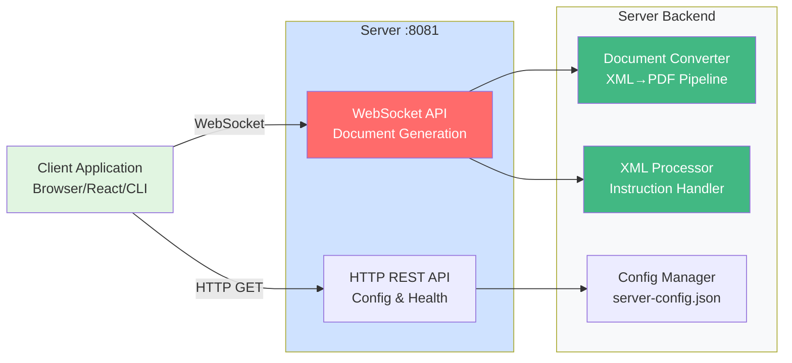
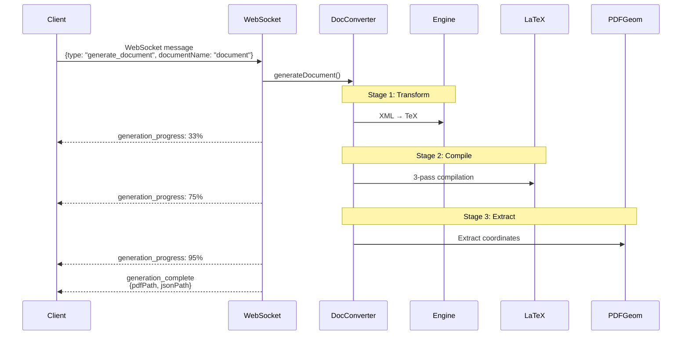
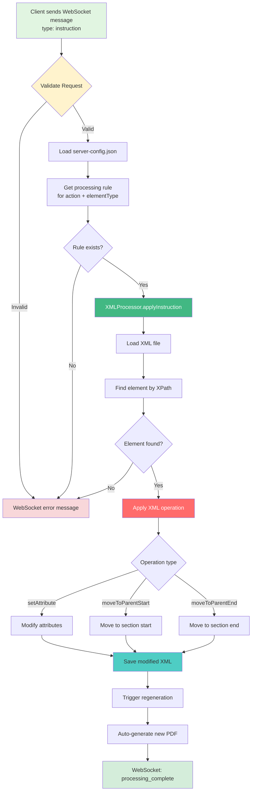

# 🌐 REST API Reference

HTTP REST API reference for the PDF Object Overlay System server.

---

## 📋 Overview

**Base URL**: `http://localhost:8081`
**Protocol**: HTTP/1.1
**Format**: JSON
**CORS**: Enabled (all origins in development)

**Important Note**: The PDF Object Overlay System primarily uses **WebSocket** for document generation and instruction processing. The HTTP REST API provides configuration and health check endpoints only.

---

## 🏗️ System Architecture at a Glance



---

## 🔄 Document Generation Flow

**Note**: Document generation is handled via **WebSocket**, not HTTP REST API.



---

## ✏️ Instruction Processing Flow

**Note**: Instruction processing is handled via **WebSocket**, not HTTP REST API.



---

## 🔑 Authentication

Currently no authentication required (development mode).

**Production Recommendation**: Add JWT or API key authentication.

---

## 📍 HTTP REST Endpoints

The server provides the following HTTP REST endpoints for configuration and health checks:

### GET `/api/dropdown-options/:type`

Get dropdown options for a specific overlay type.

**Parameters**:
- `type` - Overlay type (e.g., "figure", "table", "section")

**Response**: `200 OK`
```json
{
  "type": "figure",
  "options": [
    {
      "value": "move_bottom",
      "label": "Move Bottom"
    },
    {
      "value": "move_top",
      "label": "Move Top"
    },
    {
      "value": "move_to_section_start",
      "label": "Move to Section Start (Left Column)"
    },
    {
      "value": "move_to_section_end",
      "label": "Move to Section End (Right Column)"
    }
  ]
}
```

**Error Response**: `404 Not Found`
```json
{
  "error": "Unknown overlay type: invalid_type"
}
```

**Example**:
```bash
curl http://localhost:8081/api/dropdown-options/figure
```

```javascript
// JavaScript
const response = await fetch('http://localhost:8081/api/dropdown-options/figure');
const data = await response.json();
console.log(data.options);
```

---

### GET `/api/dropdown-options`

Get all dropdown options for all overlay types.

**Response**: `200 OK`
```json
{
  "figure": [
    {"value": "move_bottom", "label": "Move Bottom"},
    {"value": "move_top", "label": "Move Top"},
    {"value": "move_to_section_start", "label": "Move to Section Start"},
    {"value": "move_to_section_end", "label": "Move to Section End"}
  ],
  "table": [
    {"value": "move_bottom", "label": "Move Bottom"},
    {"value": "move_top", "label": "Move Top"}
  ]
}
```

**Example**:
```bash
curl http://localhost:8081/api/dropdown-options
```

---

### GET `/api/health`

Health check endpoint to verify server status.

**Response**: `200 OK`
```json
{
  "status": "ok",
  "timestamp": "2025-11-05T12:00:00.000Z",
  "clients": 3
}
```

**Example**:
```bash
curl http://localhost:8081/api/health
```

```javascript
// JavaScript
const response = await fetch('http://localhost:8081/api/health');
const data = await response.json();
console.log(data.status);
```

---

### GET `/api/config`

Get server configuration (for debugging).

**Response**: `200 OK`
```json
{
  "xmlProcessingRules": {
    "figure": {
      "move_bottom": {
        "xpath": "//figure[@id='{elementId}']",
        "operation": "setAttribute",
        "attribute": "float",
        "value": "bottom"
      }
    }
  },
  "dropdownOptions": {
    "figure": [
      {"value": "move_bottom", "label": "Move Bottom"}
    ]
  }
}
```

**Example**:
```bash
curl http://localhost:8081/api/config
```

---

## 🔄 Response Codes

| Code | Meaning | Usage |
|------|---------|-------|
| 200 | OK | Successful request |
| 400 | Bad Request | Invalid parameters |
| 404 | Not Found | Resource not found |
| 500 | Internal Server Error | Server/processing error |

---

## 📦 Request/Response Format

### Content-Type Headers

**Request**:
```
Content-Type: application/json
```

**Response**:
```
Content-Type: application/json
```

### Error Format

All errors follow this structure:
```json
{
  "success": false,
  "error": "Brief error message",
  "details": "Detailed error description",
  "timestamp": "2025-11-03T12:00:00.000Z"
}
```

---

## 🧪 Testing the HTTP API

### Using curl

```bash
# Health check
curl http://localhost:8081/api/health

# Get dropdown options for figures
curl http://localhost:8081/api/dropdown-options/figure

# Get all dropdown options
curl http://localhost:8081/api/dropdown-options

# Get server configuration
curl http://localhost:8081/api/config
```

### Using Postman

1. Import collection:
```json
{
  "info": { "name": "PDF Overlay HTTP API" },
  "item": [
    {
      "name": "Health Check",
      "request": {
        "method": "GET",
        "url": "http://localhost:8081/api/health"
      }
    },
    {
      "name": "Get Dropdown Options",
      "request": {
        "method": "GET",
        "url": "http://localhost:8081/api/dropdown-options"
      }
    },
    {
      "name": "Get Config",
      "request": {
        "method": "GET",
        "url": "http://localhost:8081/api/config"
      }
    }
  ]
}
```

### Using JavaScript/Fetch

```javascript
// HTTP API client wrapper
class PDFOverlayHTTPClient {
    constructor(baseURL = 'http://localhost:8081') {
        this.baseURL = baseURL;
    }

    async getHealth() {
        const res = await fetch(`${this.baseURL}/api/health`);
        return res.json();
    }

    async getDropdownOptions(type = null) {
        const url = type 
            ? `${this.baseURL}/api/dropdown-options/${type}`
            : `${this.baseURL}/api/dropdown-options`;
        const res = await fetch(url);
        return res.json();
    }

    async getConfig() {
        const res = await fetch(`${this.baseURL}/api/config`);
        return res.json();
    }
}

// Usage
const client = new PDFOverlayHTTPClient();
const health = await client.getHealth();
console.log(health.status);

const options = await client.getDropdownOptions('figure');
console.log(options);
```

---

## 🔒 Security Considerations

### Input Validation

Always validate:
- File paths (prevent directory traversal)
- Element IDs (prevent XML injection)
- Action names (whitelist only)

```javascript
// Validate file path
if (xmlFile.includes('..') || !xmlFile.startsWith('xml/')) {
    return res.status(400).json({ error: 'Invalid file path' });
}

// Validate action
const validActions = ['move_bottom', 'move_top', 'move_to_section_start', 'move_to_section_end'];
if (!validActions.includes(action)) {
    return res.status(400).json({ error: 'Invalid action' });
}
```

### Rate Limiting

**Recommended**: Add rate limiting for production:
```javascript
const rateLimit = require('express-rate-limit');

const limiter = rateLimit({
    windowMs: 15 * 60 * 1000, // 15 minutes
    max: 100 // limit each IP to 100 requests per windowMs
});

app.use('/api/', limiter);
```

---

## 📚 Related Documentation

- [Server Module](../modules/SERVER.md) - Server architecture and implementation
- [WebSocket Protocol](../modules/SERVER.md#websocket-protocol) - For document generation and instruction processing
- [Architecture Overview](../ARCHITECTURE.md) - System design

---

## 💡 Important Notes

1. **Document Generation** - Use WebSocket messages (`type: "generate_document"`) instead of HTTP POST
2. **Instruction Processing** - Use WebSocket messages (`type: "instruction"`) instead of HTTP POST  
3. **Real-time Updates** - All process output and progress is communicated via WebSocket
4. **HTTP API** - Limited to configuration and health checks only

For document generation and instruction processing, see the WebSocket protocol documentation in [SERVER.md](../modules/SERVER.md#websocket-protocol).

---

**Last Updated**: November 5, 2025

