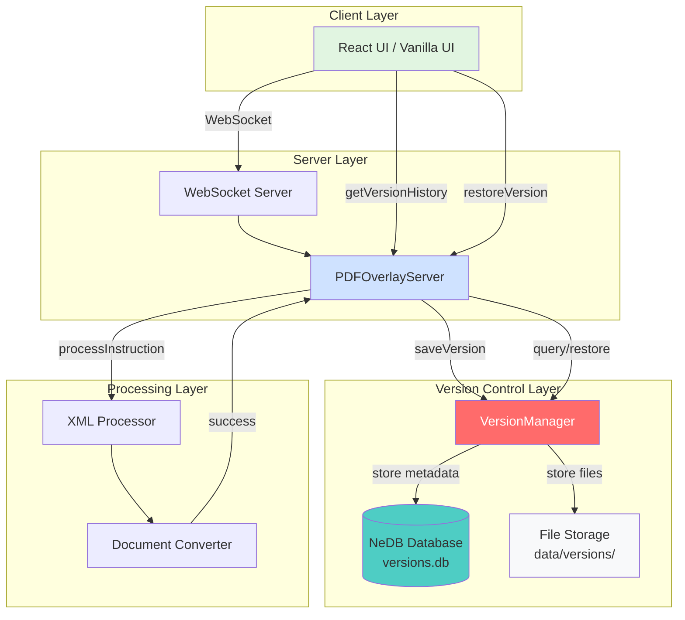
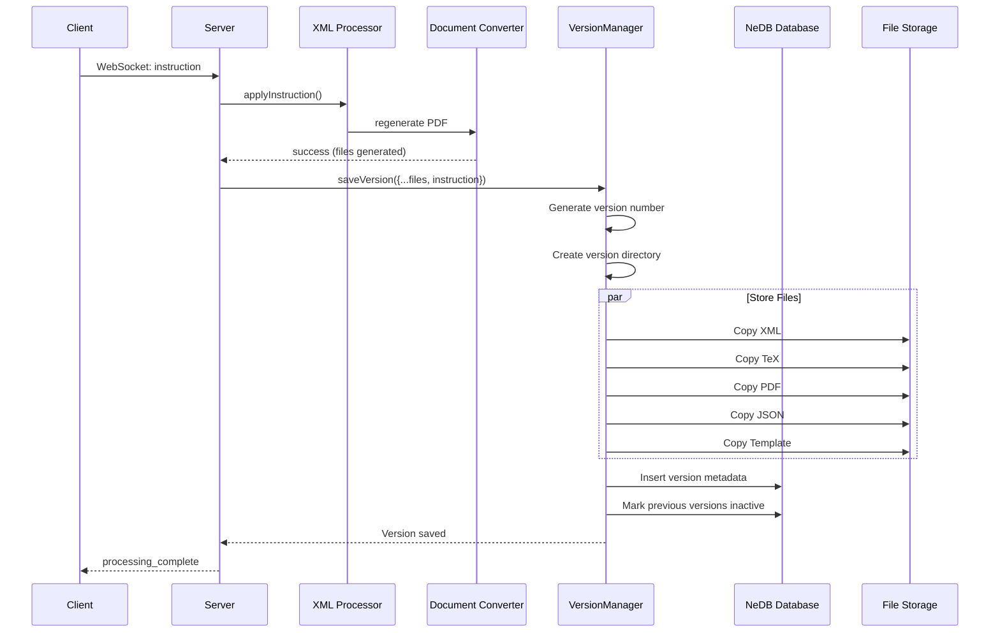
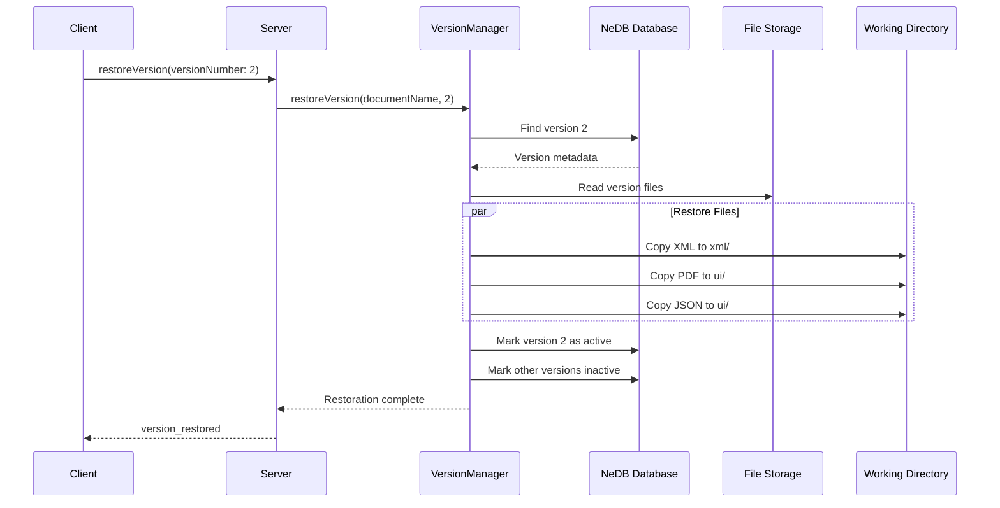

# 📚 Version Control System

Complete documentation for the Document Version Control feature in the PDF Object Overlay System.

---

## 📋 Overview

The Version Control System automatically tracks every instruction/change made to documents, allowing users to:
- **Navigate History**: View all previous versions
- **Revert Changes**: Restore any previous version
- **Track Progress**: See what instructions were applied
- **Time Travel**: Move backward and forward through document history

**Storage**: Uses **NeDB** (embedded JavaScript database) for lightweight, file-based version tracking.

---

## 🏗️ Architecture



---

## 💾 Version Storage

### Database Schema (NeDB)

Each version document contains:

```javascript
{
  "_id": "auto-generated-id",
  "documentName": "document",           // Document identifier
  "versionNumber": 5,                   // Sequential version number
  "versionHash": "a1b2c3d4...",        // Unique hash
  "timestamp": "2025-11-05T12:00:00Z", // ISO timestamp
  "userId": "system",                   // User who made the change
  "description": "Applied move_bottom to fig-1",
  
  "instruction": {
    "type": "move_bottom",              // Instruction applied
    "value": null,
    "elementId": "fig-1",
    "overlayType": "figure"
  },
  
  "files": {
    "xml": "/path/to/v5/document.xml",
    "tex": "/path/to/v5/document.tex",
    "pdf": "/path/to/v5/document.pdf",
    "json": "/path/to/v5/coordinates.json",
    "template": "/path/to/v5/template.tex.xml"
  },
  
  "versionDir": "/path/to/data/versions/document/v5_hash/",
  "isActive": true,                     // Currently active version
  "parentVersion": 4,                   // Previous version number
  
  "createdAt": "2025-11-05T12:00:00Z", // Auto-generated by NeDB
  "updatedAt": "2025-11-05T12:00:00Z"  // Auto-generated by NeDB
}
```

### File Storage Structure

```
data/
├── versions.db                          # NeDB database file
└── versions/                            # Version file storage
    ├── document/                        # Document name
    │   ├── v1_a1b2c3d4e5f6/            # Version 1
    │   │   ├── document.xml
    │   │   ├── document.tex
    │   │   ├── document.pdf
    │   │   ├── coordinates.json
    │   │   └── template.tex.xml
    │   ├── v2_f6e5d4c3b2a1/            # Version 2
    │   │   └── ...
    │   └── v3_1234567890ab/            # Version 3
    │       └── ...
    └── ENDEND10921/                     # Another document
        ├── v1_abcdef123456/
        └── v2_654321fedcba/
```

---

## 🔌 WebSocket API

### Client → Server Messages

#### 1. Get Version History

Request version history for a document.

**Message**:
```json
{
  "type": "getVersionHistory",
  "documentName": "document",
  "limit": 50
}
```

**Response**:
```json
{
  "type": "version_history",
  "documentName": "document",
  "history": [
    {
      "versionNumber": 3,
      "timestamp": "2025-11-05T12:03:00Z",
      "instruction": {
        "type": "move_bottom",
        "elementId": "fig-1",
        "overlayType": "figure"
      },
      "isActive": true,
      "userId": "system",
      "description": "Applied move_bottom to fig-1"
    },
    {
      "versionNumber": 2,
      "timestamp": "2025-11-05T12:02:00Z",
      "instruction": {
        "type": "move_to_section_start",
        "elementId": "fig-2",
        "overlayType": "figure"
      },
      "isActive": false,
      "userId": "system",
      "description": "Applied move_to_section_start to fig-2"
    }
  ]
}
```

---

#### 2. Restore Version (Revert/Forward)

Restore a specific version.

**Message**:
```json
{
  "type": "restoreVersion",
  "documentName": "document",
  "versionNumber": 2
}
```

**Response (Started)**:
```json
{
  "type": "restore_started",
  "documentName": "document",
  "versionNumber": 2
}
```

**Response (Complete)**:
```json
{
  "type": "version_restored",
  "documentName": "document",
  "versionNumber": 2,
  "timestamp": "2025-11-05T12:02:00Z",
  "files": {
    "pdfPath": "/path/to/ui/document-generated.pdf",
    "jsonPath": "/path/to/ui/document-generated-marked-boxes.json",
    "xmlPath": "/path/to/xml/document.xml"
  }
}
```

**Response (Error)**:
```json
{
  "type": "restore_error",
  "documentName": "document",
  "versionNumber": 2,
  "error": "Version 2 not found for document"
}
```

---

#### 3. Get Version Statistics

Get version statistics for a document.

**Message**:
```json
{
  "type": "getVersionStats",
  "documentName": "document"
}
```

**Response**:
```json
{
  "type": "version_stats",
  "documentName": "document",
  "stats": {
    "totalVersions": 15,
    "oldestVersion": 1,
    "latestVersion": 15,
    "totalSize": 0
  }
}
```

---

## 🔄 Version Workflow

### 1. Automatic Version Creation

Every time an instruction is processed successfully:



### 2. Version Restoration

When user restores a previous version:



---

## 💻 Usage Examples

### JavaScript Client Example

```javascript
const ws = new WebSocket('ws://localhost:8081');

// Get version history
ws.send(JSON.stringify({
    type: 'getVersionHistory',
    documentName: 'document',
    limit: 20
}));

// Listen for version history
ws.onmessage = (event) => {
    const msg = JSON.parse(event.data);
    
    if (msg.type === 'version_history') {
        console.log('Version History:', msg.history);
        
        // Display in UI
        msg.history.forEach(version => {
            console.log(`Version ${version.versionNumber}:`, version.instruction);
        });
    }
};

// Restore a specific version (e.g., go back to version 5)
function restoreVersion(versionNumber) {
    ws.send(JSON.stringify({
        type: 'restoreVersion',
        documentName: 'document',
        versionNumber: versionNumber
    }));
}

// Restore version 5
restoreVersion(5);

// Listen for restoration complete
ws.onmessage = (event) => {
    const msg = JSON.parse(event.data);
    
    if (msg.type === 'version_restored') {
        console.log(`✅ Restored to version ${msg.versionNumber}`);
        // Reload PDF viewer with new files
        loadPDF(msg.files.pdfPath);
        loadOverlays(msg.files.jsonPath);
    }
    
    if (msg.type === 'restore_error') {
        console.error(`❌ Restore failed: ${msg.error}`);
    }
};
```

### React Component Example

```jsx
import { useState, useEffect } from 'react';

function VersionControl({ websocket, documentName }) {
    const [versions, setVersions] = useState([]);
    const [currentVersion, setCurrentVersion] = useState(null);
    
    useEffect(() => {
        // Request version history
        websocket.send(JSON.stringify({
            type: 'getVersionHistory',
            documentName: documentName
        }));
        
        // Listen for version updates
        websocket.onmessage = (event) => {
            const msg = JSON.parse(event.data);
            
            if (msg.type === 'version_history') {
                setVersions(msg.history);
                const active = msg.history.find(v => v.isActive);
                setCurrentVersion(active?.versionNumber);
            }
            
            if (msg.type === 'version_restored') {
                setCurrentVersion(msg.versionNumber);
            }
        };
    }, [websocket, documentName]);
    
    const handleRestore = (versionNumber) => {
        websocket.send(JSON.stringify({
            type: 'restoreVersion',
            documentName: documentName,
            versionNumber: versionNumber
        }));
    };
    
    return (
        <div className="version-control">
            <h3>Version History</h3>
            <div className="version-list">
                {versions.map((version) => (
                    <div 
                        key={version.versionNumber}
                        className={version.isActive ? 'version active' : 'version'}
                    >
                        <span>Version {version.versionNumber}</span>
                        <span>{new Date(version.timestamp).toLocaleString()}</span>
                        <span>{version.instruction.type} on {version.instruction.elementId}</span>
                        {!version.isActive && (
                            <button onClick={() => handleRestore(version.versionNumber)}>
                                Restore
                            </button>
                        )}
                    </div>
                ))}
            </div>
            
            <div className="version-navigation">
                <button 
                    onClick={() => handleRestore(currentVersion - 1)}
                    disabled={currentVersion <= 1}
                >
                    ⏮️ Previous
                </button>
                <span>Version {currentVersion}</span>
                <button 
                    onClick={() => handleRestore(currentVersion + 1)}
                    disabled={currentVersion >= versions.length}
                >
                    ⏭️ Next
                </button>
            </div>
        </div>
    );
}
```

---

## 🔧 VersionManager API

### Core Methods

#### `saveVersion(versionData)`

Save a new version after instruction processing.

```javascript
await versionManager.saveVersion({
    documentName: 'document',
    instruction: 'move_bottom',
    instructionValue: null,
    elementId: 'fig-1',
    overlayType: 'figure',
    xmlPath: '/path/to/document.xml',
    texPath: '/path/to/document.tex',
    pdfPath: '/path/to/document.pdf',
    jsonPath: '/path/to/coordinates.json',
    templatePath: '/path/to/template.tex.xml',
    userId: 'user123',
    description: 'Moved figure to bottom'
});
```

#### `getVersionHistory(documentName, limit)`

Get version history for a document.

```javascript
const history = await versionManager.getVersionHistory('document', 50);
```

#### `restoreVersion(documentName, versionNumber)`

Restore a specific version.

```javascript
const result = await versionManager.restoreVersion('document', 5);
console.log(result.files.pdf); // Path to restored PDF
```

#### `getActiveVersion(documentName)`

Get the currently active version.

```javascript
const activeVersion = await versionManager.getActiveVersion('document');
console.log(activeVersion.versionNumber); // e.g., 7
```

#### `getVersionStats(documentName)`

Get statistics about versions.

```javascript
const stats = await versionManager.getVersionStats('document');
// { totalVersions: 15, oldestVersion: 1, latestVersion: 15 }
```

#### `cleanupOldVersions(documentName, keepLast)`

Clean up old versions (keep only last N versions).

```javascript
await versionManager.cleanupOldVersions('document', 20);
// Keeps last 20 versions, deletes older ones
```

---

## 🎯 Use Cases

### 1. Undo Last Change

```javascript
// Get current version
const active = await versionManager.getActiveVersion('document');
const previousVersion = active.versionNumber - 1;

// Restore previous version
await versionManager.restoreVersion('document', previousVersion);
```

### 2. Compare Two Versions

```javascript
const diff = await versionManager.getVersionDiff('document', 5, 8);
console.log('From:', diff.fromVersion);
console.log('To:', diff.toVersion);
console.log('Changes:', diff.instructionChanges);
```

### 3. View Timeline

```javascript
const history = await versionManager.getVersionHistory('document', 100);

history.forEach(v => {
    console.log(`[${v.timestamp}] v${v.versionNumber}: ${v.instruction.type} on ${v.instruction.elementId}`);
});
```

### 4. Periodic Cleanup

```javascript
// Run cleanup every day (keep last 30 versions)
setInterval(async () => {
    await versionManager.cleanupOldVersions('document', 30);
}, 24 * 60 * 60 * 1000);
```

---

## 🔐 Security Considerations

### Access Control

Add user authentication to version operations:

```javascript
async restoreVersion(ws, data) {
    // Verify user has permission
    if (!data.userId || !hasPermission(data.userId, 'restore_versions')) {
        return this.sendToClient(ws, {
            type: 'error',
            message: 'Permission denied'
        });
    }
    
    // Proceed with restoration
    await this.versionManager.restoreVersion(...);
}
```

### Audit Trail

All version operations are automatically logged with:
- **User ID**: Who made the change
- **Timestamp**: When the change occurred
- **Instruction**: What was changed

---

## 📊 Performance Considerations

### Storage Optimization

- **Automatic Cleanup**: Use `cleanupOldVersions()` to limit storage growth
- **Compression**: Consider compressing old version files
- **Deduplication**: Store only changed files (future enhancement)

### Query Performance

- **Indexed Fields**: `documentName`, `versionNumber`, `timestamp`
- **Pagination**: Use `limit` parameter in `getVersionHistory()`
- **Caching**: Cache active version in memory

---

## 🚀 Future Enhancements

1. **Diff Generation**: Show textual diffs between versions
2. **Branching**: Support multiple version branches
3. **Tags**: Tag important versions (e.g., "v1.0-release")
4. **Compression**: Compress old version files
5. **Cloud Backup**: Sync versions to cloud storage
6. **Collaborative Versioning**: Multi-user version tracking

---

## 📚 Related Documentation

- [Server Module](../modules/SERVER.md) - Server architecture
- [WebSocket Protocol](../modules/SERVER.md#websocket-protocol) - WebSocket API reference
- [Architecture Overview](../ARCHITECTURE.md) - System design

---

**Version Control System Ready! 🎉**

*Last Updated: November 5, 2025*

