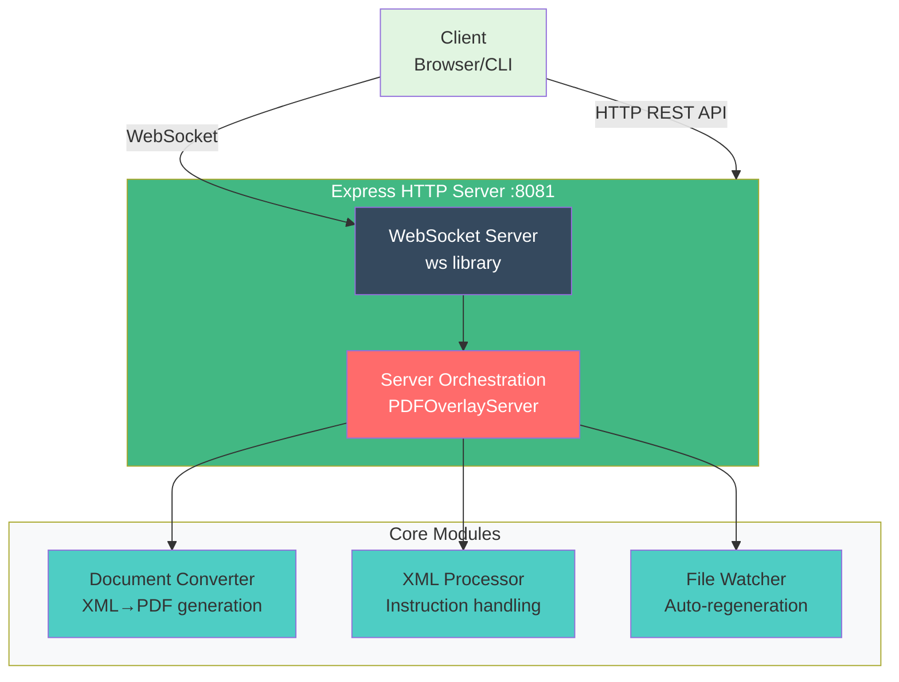
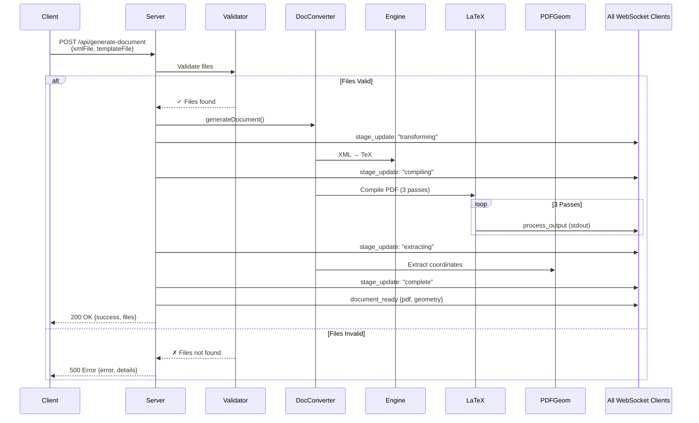
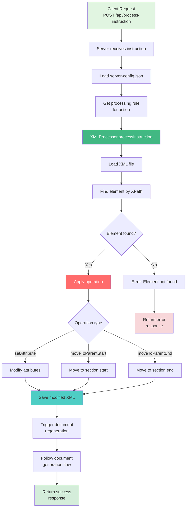

# 🖥️ Server Module (server.js)

The **Server** is the main application server that provides HTTP API endpoints, WebSocket communication for real-time updates, and orchestrates document processing workflows.

---

## 📋 Overview

**File**: `server/server.js`  
**Purpose**: Application server with HTTP API and WebSocket support  
**Port**: 8081 (default)  
**Dependencies**: `express`, `ws`, `chokidar`, custom modules

### Key Responsibilities
- HTTP REST API endpoints
- WebSocket server for real-time communication
- Document generation orchestration
- XML instruction processing
- File watching and auto-regeneration
- Client session management

---

## 🏗️ Architecture

### Server Class Structure

```javascript
class PDFOverlayServer {
    constructor() {
        this.configManager = new ConfigManager();
        this.xmlProcessor = new XMLProcessor();
        this.documentConverter = new DocumentConverter();
        this.fileWatcher = new FileWatcher();
        this.clients = new Set(); // WebSocket clients
        this.port = 8081;
    }
}
```

### Server Stack



---

## 🔌 HTTP API Endpoints

### GET `/api/templates`

Get list of available LaTeX templates.

**Response**:
```json
{
  "templates": [
    {
      "name": "document.tex.xml",
      "path": "template/document.tex.xml"
    },
    {
      "name": "ENDEND10921-sample-style.tex.xml",
      "path": "template/ENDEND10921-sample-style.tex.xml"
    }
  ]
}
```

**Example**:
```bash
curl http://localhost:8081/api/templates
```

---

### GET `/api/xml-files`

Get list of available XML input files.

**Response**:
```json
{
  "xmlFiles": [
    {
      "name": "document.xml",
      "path": "xml/document.xml"
    },
    {
      "name": "ENDEND10921.xml",
      "path": "xml/ENDEND10921.xml"
    }
  ]
}
```

---

### POST `/api/generate-document`

Generate PDF from XML and template.

**Request Body**:
```json
{
  "xmlFile": "xml/document.xml",
  "templateFile": "template/document.tex.xml"
}
```

**Response**:
```json
{
  "success": true,
  "message": "Document generated successfully",
  "files": {
    "pdf": "TeX/document-generated.pdf",
    "tex": "TeX/document-generated.tex",
    "geometry": "TeX/document-generated-geometry.json"
  }
}
```

**Error Response**:
```json
{
  "success": false,
  "error": "Failed to generate document",
  "details": "Template file not found"
}
```

**Example**:
```bash
curl -X POST http://localhost:8081/api/generate-document \
  -H "Content-Type: application/json" \
  -d '{
    "xmlFile": "xml/document.xml",
    "templateFile": "template/document.tex.xml"
  }'
```

---

### POST `/api/process-instruction`

Process a user instruction (e.g., move figure, change placement).

**Request Body**:
```json
{
  "elementType": "figure",
  "action": "move_to_section_start",
  "elementId": "fig-1",
  "xmlFile": "xml/document.xml"
}
```

**Response**:
```json
{
  "success": true,
  "message": "Instruction processed successfully",
  "action": "move_to_section_start",
  "elementId": "fig-1"
}
```

**Available Actions** (from server-config.json):
- `move_bottom` - Move element to bottom of page
- `move_top` - Move element to top of page
- `move_to_section_start` - Move to start of parent section
- `move_to_section_end` - Move to end of parent section

**Example**:
```bash
curl -X POST http://localhost:8081/api/process-instruction \
  -H "Content-Type: application/json" \
  -d '{
    "elementType": "figure",
    "action": "move_to_section_start",
    "elementId": "fig-1",
    "xmlFile": "xml/document.xml"
  }'
```

---

### GET `/api/dropdown-options`

Get available dropdown options for UI (configured in server-config.json).

**Response**:
```json
{
  "figure": [
    {"value": "move_bottom", "label": "Move Bottom"},
    {"value": "move_top", "label": "Move Top"},
    {"value": "move_to_section_start", "label": "Move to Section Start"},
    {"value": "move_to_section_end", "label": "Move to Section End"}
  ]
}
```

---

### GET `/api/current-document`

Get information about the currently loaded document.

**Response**:
```json
{
  "xmlFile": "xml/document.xml",
  "templateFile": "template/document.tex.xml",
  "generatedFiles": {
    "pdf": "TeX/document-generated.pdf",
    "geometry": "TeX/document-generated-geometry.json"
  }
}
```

---

## 📡 WebSocket Protocol

### Connection

**URL**: `ws://localhost:8081`

**Client Connection**:
```javascript
const ws = new WebSocket('ws://localhost:8081');

ws.onopen = () => {
    console.log('Connected to server');
};

ws.onmessage = (event) => {
    const message = JSON.parse(event.data);
    handleMessage(message);
};
```

---

### Message Types

#### 1. `stage_update` - Processing Stage Update

Sent when the document generation stage changes.

**Message**:
```json
{
  "type": "stage_update",
  "stage": "compiling",
  "message": "Compiling LaTeX (pass 2/3)...",
  "timestamp": "2025-11-03T12:00:00.000Z"
}
```

**Stages**:
- `transforming` - XML → TeX transformation
- `compiling` - LaTeX compilation
- `extracting` - Coordinate extraction
- `complete` - Generation complete
- `error` - Error occurred

---

#### 2. `process_output` - Real-time Process Output

Sent during LaTeX compilation to show live output.

**Message**:
```json
{
  "type": "process_output",
  "outputType": "stdout",
  "message": "This is pdfTeX, Version 3.14159265...",
  "timestamp": "2025-11-03T12:00:01.000Z"
}
```

**Output Types**:
- `stdout` - Standard output from LuaLaTeX
- `stderr` - Error output from LuaLaTeX

---

#### 3. `document_ready` - Document Generation Complete

Sent when PDF generation is complete.

**Message**:
```json
{
  "type": "document_ready",
  "files": {
    "pdf": "TeX/document-generated.pdf",
    "geometry": "TeX/document-generated-geometry.json"
  },
  "timestamp": "2025-11-03T12:00:05.000Z"
}
```

---

#### 4. `error` - Error Notification

Sent when an error occurs.

**Message**:
```json
{
  "type": "error",
  "error": "Compilation failed",
  "details": "LaTeX error on line 42",
  "timestamp": "2025-11-03T12:00:03.000Z"
}
```

---

## 🔄 Server Workflow

### Document Generation Flow



---

### Instruction Processing Flow



---

## ⚙️ Configuration

### Server Port

Change port via environment variable or code:

```bash
# Environment variable
PORT=8082 node server/server.js

# Or in code (server.js)
this.port = process.env.PORT || 8081;
```

---

### CORS Configuration

CORS is enabled for all origins (for development):

```javascript
this.app.use((req, res, next) => {
    res.header('Access-Control-Allow-Origin', '*');
    res.header('Access-Control-Allow-Methods', 'GET, POST, PUT, DELETE, OPTIONS');
    res.header('Access-Control-Allow-Headers', 'Origin, X-Requested-With, Content-Type, Accept');
    next();
});
```

**Production**: Restrict origins:
```javascript
res.header('Access-Control-Allow-Origin', 'https://yourdomain.com');
```

---

## 🧪 Testing the Server

### Manual Testing

```bash
# Start server
npm run server

# Test template listing
curl http://localhost:8081/api/templates

# Test document generation
curl -X POST http://localhost:8081/api/generate-document \
  -H "Content-Type: application/json" \
  -d '{"xmlFile": "xml/document.xml", "templateFile": "template/document.tex.xml"}'

# Test WebSocket (using wscat)
npm install -g wscat
wscat -c ws://localhost:8081
```

---

### Automated Testing

```javascript
// test/server.test.js
const request = require('supertest');
const app = require('../server/server');

describe('Server API', () => {
    test('GET /api/templates', async () => {
        const response = await request(app)
            .get('/api/templates')
            .expect(200);
        
        expect(response.body.templates).toBeDefined();
        expect(Array.isArray(response.body.templates)).toBe(true);
    });
    
    test('POST /api/generate-document', async () => {
        const response = await request(app)
            .post('/api/generate-document')
            .send({
                xmlFile: 'xml/document.xml',
                templateFile: 'template/document.tex.xml'
            })
            .expect(200);
        
        expect(response.body.success).toBe(true);
        expect(response.body.files.pdf).toBeDefined();
    });
});
```

---

## 🐛 Debugging

### Enable Verbose Logging

```javascript
// In server.js
const DEBUG = true;

if (DEBUG) {
    console.log('🔍 Request:', req.body);
    console.log('🔍 Processing instruction:', instruction);
}
```

### View WebSocket Messages

```javascript
// In browser console
const ws = new WebSocket('ws://localhost:8081');
ws.onmessage = (event) => {
    const msg = JSON.parse(event.data);
    console.log('📨 WebSocket:', msg);
};
```

### Check Server Logs

```bash
# Server logs to console
# Redirect to file
npm run server > logs/server.log 2>&1
```

---

## 🔧 Extending the Server

### Adding New Endpoint

```javascript
// In server.js, add to setupRoutes()
this.app.post('/api/my-new-endpoint', async (req, res) => {
    try {
        const result = await this.myNewFunction(req.body);
        res.json({ success: true, result });
    } catch (error) {
        res.status(500).json({ success: false, error: error.message });
    }
});
```

### Adding New WebSocket Message Type

```javascript
// Emit new message type
this.broadcastToAllClients({
    type: 'my_custom_event',
    data: myData,
    timestamp: new Date().toISOString()
});
```

### Adding Middleware

```javascript
// Add logging middleware
this.app.use((req, res, next) => {
    console.log(`${req.method} ${req.path}`);
    next();
});
```

---

## 📚 Related Documentation

- [Document Converter Module](./DOCUMENT-CONVERTER.md)
- [XML Processor Module](./XML-PROCESSOR.md)
- [WebSocket API Reference](../api/WEBSOCKET-API.md)
- [REST API Reference](../api/REST-API.md)

---

**Last Updated**: November 3, 2025

