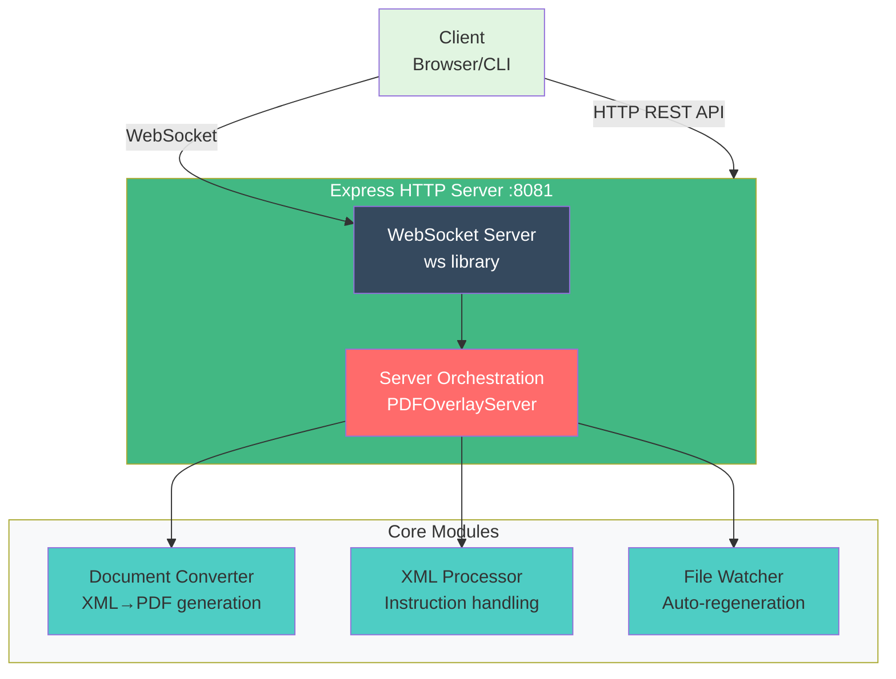
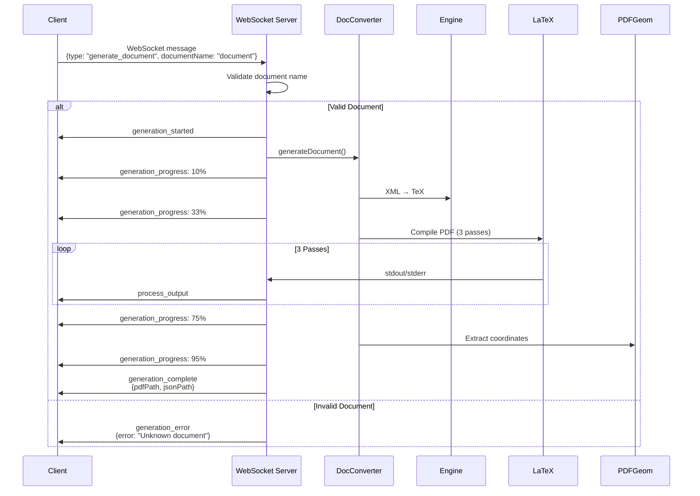
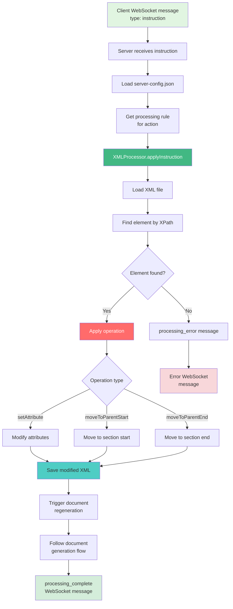

# 🖥️ Server Module (server.js)

The **Server** is the main application server that provides HTTP API endpoints, WebSocket communication for real-time updates, and orchestrates document processing workflows.

---

## 📋 Overview

**File**: `server/server.js`  
**Purpose**: Application server with HTTP API and WebSocket support  
**Port**: 8081 (default)  
**Dependencies**: `express`, `ws`, `chokidar`, custom modules

### Key Responsibilities
- HTTP REST API endpoints
- WebSocket server for real-time communication
- Document generation orchestration
- XML instruction processing
- File watching and auto-regeneration
- Client session management
- Document version control and history management

---

## 🏗️ Architecture

### Server Class Structure

```javascript
class PDFOverlayServer {
    constructor() {
        this.configManager = new ConfigManager();
        this.xmlProcessor = new XMLProcessor();
        this.documentConverter = new DocumentConverter();
        this.fileWatcher = new FileWatcher();
        this.clients = new Set(); // WebSocket clients
        this.port = 8081;
    }
}
```

### Server Stack



---

## 🔌 HTTP API Endpoints

The server provides a minimal HTTP REST API for configuration and health checks. Document generation and instruction processing are handled via **WebSocket**.

### GET `/api/dropdown-options/:type`

Get dropdown options for a specific overlay type.

**Parameters**:
- `type` - Overlay type (e.g., "figure", "table", "section")

**Response**:
```json
{
  "type": "figure",
  "options": [
    {"value": "move_bottom", "label": "Move Bottom"},
    {"value": "move_top", "label": "Move Top"},
    {"value": "move_to_section_start", "label": "Move to Section Start"},
    {"value": "move_to_section_end", "label": "Move to Section End"}
  ]
}
```

**Example**:
```bash
curl http://localhost:8081/api/dropdown-options/figure
```

---

### GET `/api/dropdown-options`

Get all dropdown options for all overlay types (configured in server-config.json).

**Response**:
```json
{
  "figure": [
    {"value": "move_bottom", "label": "Move Bottom"},
    {"value": "move_top", "label": "Move Top"},
    {"value": "move_to_section_start", "label": "Move to Section Start"},
    {"value": "move_to_section_end", "label": "Move to Section End"}
  ],
  "table": [
    {"value": "move_bottom", "label": "Move Bottom"},
    {"value": "move_top", "label": "Move Top"}
  ]
}
```

**Example**:
```bash
curl http://localhost:8081/api/dropdown-options
```

---

### GET `/api/health`

Health check endpoint to verify server status.

**Response**:
```json
{
  "status": "ok",
  "timestamp": "2025-11-05T12:00:00.000Z",
  "clients": 3
}
```

**Example**:
```bash
curl http://localhost:8081/api/health
```

---

### GET `/api/config`

Get server configuration (for debugging).

**Response**:
```json
{
  "xmlProcessingRules": {
    "figure": {
      "move_bottom": {
        "xpath": "//figure[@id='{elementId}']",
        "operation": "setAttribute",
        "attribute": "float",
        "value": "bottom"
      }
    }
  },
  "dropdownOptions": {
    "figure": [
      {"value": "move_bottom", "label": "Move Bottom"}
    ]
  }
}
```

**Example**:
```bash
curl http://localhost:8081/api/config
```

---

## 📡 WebSocket Protocol

### Connection

**URL**: `ws://localhost:8081`

**Client Connection**:
```javascript
const ws = new WebSocket('ws://localhost:8081');

ws.onopen = () => {
    console.log('Connected to server');
};

ws.onmessage = (event) => {
    const message = JSON.parse(event.data);
    handleMessage(message);
};
```

---

### Client to Server Messages

#### 1. `generate_document` - Generate PDF

Request document generation.

**Message**:
```json
{
  "type": "generate_document",
  "documentName": "document"
}
```

**Supported Documents**:
- `"document"` - Uses `xml/document.xml` and `template/document.tex.xml`
- `"ENDEND10921"` - Uses `xml/ENDEND10921.xml` and `template/ENDEND10921-sample-style.tex.xml`

---

#### 2. `instruction` - Process Instruction

Apply an instruction to modify XML.

**Message**:
```json
{
  "type": "instruction",
  "elementId": "fig-1",
  "overlayType": "figure",
  "instruction": "move_bottom",
  "instructionValue": null
}
```

**Available Instructions** (from server-config.json):
- `move_bottom` - Move element to bottom of page
- `move_top` - Move element to top of page
- `move_to_section_start` - Move to start of parent section
- `move_to_section_end` - Move to end of parent section

---

#### 3. `ping` - Health Check

Ping the server to check connection.

**Message**:
```json
{
  "type": "ping"
}
```

**Response**:
```json
{
  "type": "pong",
  "timestamp": 1699027200000
}
```

---

#### 4. `getDropdownOptions` - Get Dropdown Options

Request dropdown options for a specific overlay type.

**Message**:
```json
{
  "type": "getDropdownOptions",
  "overlayType": "figure"
}
```

---

### Server to Client Messages

#### 1. `config` - Initial Configuration

Sent immediately after connection.

**Message**:
```json
{
  "type": "config",
  "data": {
    "dropdownOptions": {
      "figure": [
        {"value": "move_bottom", "label": "Move Bottom"}
      ]
    }
  }
}
```

---

#### 2. `generation_started` - Document Generation Started

**Message**:
```json
{
  "type": "generation_started",
  "documentName": "document"
}
```

---

#### 3. `generation_progress` - Generation Progress Update

**Message**:
```json
{
  "type": "generation_progress",
  "progress": 33,
  "message": "TeX conversion complete. Compiling PDF..."
}
```

**Progress Values**:
- `10` - Converting XML to TeX
- `33` - TeX conversion complete, compiling PDF
- `75` - PDF compiled, copying files
- `95` - Files copied, finalizing

---

#### 4. `generation_complete` - Generation Complete

**Message**:
```json
{
  "type": "generation_complete",
  "documentName": "document",
  "pdfPath": "/path/to/ui/document-generated.pdf",
  "jsonPath": "/path/to/ui/document-generated-marked-boxes.json"
}
```

---

#### 5. `generation_error` - Generation Error

**Message**:
```json
{
  "type": "generation_error",
  "documentName": "document",
  "error": "Template file not found: /path/to/template.tex.xml"
}
```

---

#### 6. `processing_started` - Instruction Processing Started

**Message**:
```json
{
  "type": "processing_started",
  "elementId": "fig-1",
  "overlayType": "figure",
  "instruction": "move_bottom"
}
```

---

#### 7. `processing_progress` - Processing Progress Update

**Message**:
```json
{
  "type": "processing_progress",
  "progress": 50,
  "message": "Compiling updated PDF..."
}
```

---

#### 8. `processing_complete` - Processing Complete

**Message**:
```json
{
  "type": "processing_complete",
  "elementId": "fig-1",
  "overlayType": "figure",
  "instruction": "move_bottom",
  "result": {
    "pdfPath": "/path/to/ui/document-generated.pdf",
    "jsonPath": "/path/to/ui/document-generated-marked-boxes.json",
    "timestamp": "2025-11-05T12:00:00.000Z"
  }
}
```

---

#### 9. `processing_error` - Processing Error

**Message**:
```json
{
  "type": "processing_error",
  "elementId": "fig-1",
  "error": "Element not found: fig-1"
}
```

---

#### 10. `process_output` - Real-time Process Output

Sent during LaTeX compilation to show live output.

**Message**:
```json
{
  "type": "process_output",
  "outputType": "stdout",
  "message": "This is LuaTeX, Version 1.10.0...",
  "timestamp": "2025-11-05T12:00:01.000Z"
}
```

**Output Types**:
- `stdout` - Standard output from LuaLaTeX
- `stderr` - Error output from LuaLaTeX

---

#### 11. `file_change` - File System Change

Sent when a watched file changes.

**Message**:
```json
{
  "type": "file_change",
  "eventType": "change",
  "filePath": "/path/to/file.xml",
  "timestamp": "2025-11-05T12:00:00.000Z"
}
```

---

#### 12. `dropdown_options` - Dropdown Options

Response to `getDropdownOptions` request.

**Message**:
```json
{
  "type": "dropdown_options",
  "overlayType": "figure",
  "options": [
    {"value": "move_bottom", "label": "Move Bottom"},
    {"value": "move_top", "label": "Move Top"}
  ]
}
```

---

#### 13. `error` - Generic Error

**Message**:
```json
{
  "type": "error",
  "message": "Failed to process message: Invalid JSON"
}
```

---

## 🔄 Server Workflow

### Document Generation Flow



---

### Instruction Processing Flow



---

## ⚙️ Configuration

### Server Port

Change port via environment variable or code:

```bash
# Environment variable
PORT=8082 node server/server.js

# Or in code (server.js)
this.port = process.env.PORT || 8081;
```

---

### CORS Configuration

CORS is enabled for all origins (for development):

```javascript
this.app.use((req, res, next) => {
    res.header('Access-Control-Allow-Origin', '*');
    res.header('Access-Control-Allow-Methods', 'GET, POST, PUT, DELETE, OPTIONS');
    res.header('Access-Control-Allow-Headers', 'Origin, X-Requested-With, Content-Type, Accept');
    next();
});
```

**Production**: Restrict origins:
```javascript
res.header('Access-Control-Allow-Origin', 'https://yourdomain.com');
```

---

## 🧪 Testing the Server

### Manual Testing - HTTP API

```bash
# Start server
npm run server

# Test health check
curl http://localhost:8081/api/health

# Test dropdown options
curl http://localhost:8081/api/dropdown-options

# Test dropdown options for specific type
curl http://localhost:8081/api/dropdown-options/figure

# Test config endpoint
curl http://localhost:8081/api/config
```

### Manual Testing - WebSocket

```bash
# Install wscat
npm install -g wscat

# Connect to WebSocket
wscat -c ws://localhost:8081

# Once connected, send messages:
# Generate document
{"type":"generate_document","documentName":"document"}

# Process instruction
{"type":"instruction","elementId":"fig-1","overlayType":"figure","instruction":"move_bottom","instructionValue":null}

# Ping
{"type":"ping"}
```

---

### Automated Testing

```javascript
// test/server.test.js
const request = require('supertest');
const WebSocket = require('ws');
const app = require('../server/server');

describe('HTTP API', () => {
    test('GET /api/health', async () => {
        const response = await request(app)
            .get('/api/health')
            .expect(200);
        
        expect(response.body.status).toBe('ok');
        expect(response.body.clients).toBeDefined();
    });
    
    test('GET /api/dropdown-options', async () => {
        const response = await request(app)
            .get('/api/dropdown-options')
            .expect(200);
        
        expect(response.body).toBeDefined();
        expect(typeof response.body).toBe('object');
    });
    
    test('GET /api/config', async () => {
        const response = await request(app)
            .get('/api/config')
            .expect(200);
        
        expect(response.body.xmlProcessingRules).toBeDefined();
        expect(response.body.dropdownOptions).toBeDefined();
    });
});

describe('WebSocket API', () => {
    let ws;
    
    beforeEach(() => {
        ws = new WebSocket('ws://localhost:8081');
    });
    
    afterEach(() => {
        if (ws) ws.close();
    });
    
    test('WebSocket connection', (done) => {
        ws.on('open', () => {
            done();
        });
    });
    
    test('Ping/Pong', (done) => {
        ws.on('open', () => {
            ws.send(JSON.stringify({ type: 'ping' }));
        });
        
        ws.on('message', (data) => {
            const msg = JSON.parse(data);
            if (msg.type === 'pong') {
                expect(msg.timestamp).toBeDefined();
                done();
            }
        });
    });
    
    test('Generate document', (done) => {
        ws.on('open', () => {
            ws.send(JSON.stringify({
                type: 'generate_document',
                documentName: 'document'
            }));
        });
        
        ws.on('message', (data) => {
            const msg = JSON.parse(data);
            if (msg.type === 'generation_complete') {
                expect(msg.pdfPath).toBeDefined();
                expect(msg.jsonPath).toBeDefined();
                done();
            }
        });
    }, 30000); // 30 second timeout for PDF generation
});
```

---

## 🐛 Debugging

### Enable Verbose Logging

```javascript
// In server.js
const DEBUG = true;

if (DEBUG) {
    console.log('🔍 Request:', req.body);
    console.log('🔍 Processing instruction:', instruction);
}
```

### View WebSocket Messages

```javascript
// In browser console
const ws = new WebSocket('ws://localhost:8081');
ws.onmessage = (event) => {
    const msg = JSON.parse(event.data);
    console.log('📨 WebSocket:', msg);
};
```

### Check Server Logs

```bash
# Server logs to console
# Redirect to file
npm run server > logs/server.log 2>&1
```

---

## 🔧 Extending the Server

### Adding New Endpoint

```javascript
// In server.js, add to setupRoutes()
this.app.post('/api/my-new-endpoint', async (req, res) => {
    try {
        const result = await this.myNewFunction(req.body);
        res.json({ success: true, result });
    } catch (error) {
        res.status(500).json({ success: false, error: error.message });
    }
});
```

### Adding New WebSocket Message Type

```javascript
// Emit new message type
this.broadcastToAllClients({
    type: 'my_custom_event',
    data: myData,
    timestamp: new Date().toISOString()
});
```

### Adding Middleware

```javascript
// Add logging middleware
this.app.use((req, res, next) => {
    console.log(`${req.method} ${req.path}`);
    next();
});
```

---

## 📚 Related Documentation

- [REST API Reference](../api/REST-API.md) - HTTP REST endpoints
- [Architecture Overview](../ARCHITECTURE.md) - System design
- [Getting Started](../GETTING-STARTED.md) - Development setup

---

## 💡 Key Points

1. **HTTP API** - Limited to configuration, health checks, and dropdown options
2. **WebSocket API** - Primary interface for document generation and instruction processing
3. **Real-time Updates** - All process output is streamed via WebSocket
4. **Multiple Clients** - Server broadcasts updates to all connected WebSocket clients

---

**Last Updated**: November 5, 2025

