# 🔄 XML to PDF Pipeline Workflow

Complete workflow documentation for transforming XML documents into PDFs with precise coordinate data.

---

## 📋 Overview

The XML to PDF pipeline is the core workflow of the application, transforming structured XML into professionally formatted PDFs with extracted element coordinates.

**Pipeline**: `XML → Template → TeX → PDF → Coordinates → JSON`

**Duration**: ~5-10 seconds (for typical document)

---

## 🎯 Complete Pipeline Flow

```mermaid
flowchart TD
    subgraph INPUT["1. INPUT STAGE"]
        XML[XML File<br/>document.xml]
        Template[Template File<br/>document.tex.xml]
    end
    
    subgraph TRANSFORM["2. TRANSFORMATION STAGE"]
        Engine[Engine - engine.js]
        ParseXML[Parse XML]
        LoadTemplate[Load Template]
        Match[Match Elements<br/>CSS selectors]
        Apply[Apply Templates<br/>Recursively]
        GenTeX[Generate TeX Output]
        
        Engine --> ParseXML
        Engine --> LoadTemplate
        ParseXML --> Match
        LoadTemplate --> Match
        Match --> Apply
        Apply --> GenTeX
    end
    
    subgraph COMPILE["3. COMPILATION STAGE"]
        LuaLaTeX[LuaLaTeX<br/>3-pass compilation]
        Pass1[Pass 1:<br/>Initial compilation<br/>Create .aux with zref]
        Pass2[Pass 2:<br/>Resolve references<br/>Process floats]
        Pass3[Pass 3:<br/>Final positioning<br/>Accurate coordinates]
        
        LuaLaTeX --> Pass1
        Pass1 --> Pass2
        Pass2 --> Pass3
    end
    
    subgraph EXTRACT["4. COORDINATE EXTRACTION"]
        PDFGeom[PDF Geometry<br/>pdf-geometry.js]
        ParseAux[Parse .aux file]
        ExtractZref[Extract zref<br/>coordinates]
        ProcessNDJSON[Process NDJSON data]
        CalcBounds[Calculate<br/>bounding boxes]
        Convert[Convert<br/>coordinate systems]
        GenJSON[Generate<br/>geometry JSON]
        
        PDFGeom --> ParseAux
        ParseAux --> ExtractZref
        ExtractZref --> ProcessNDJSON
        ProcessNDJSON --> CalcBounds
        CalcBounds --> Convert
        Convert --> GenJSON
    end
    
    subgraph OUTPUT["5. OUTPUT STAGE"]
        PDFFile[PDF File<br/>for viewing]
        GeomFile[Geometry JSON<br/>for overlays]
        TexFile[TeX File<br/>for debug]
    end
    
    XML --> Engine
    Template --> Engine
    GenTeX --> TexFileGen[.tex File<br/>document-generated.tex]
    TexFileGen --> LuaLaTeX
    
    Pass3 --> Files{Generated Files}
    Files -->|.pdf| PDFFile
    Files -->|.aux| PDFGeom
    Files -->|.ndjson| PDFGeom
    Files -->|.tex| TexFile
    
    GenJSON --> GeomFile
    
    style INPUT fill:#e1f5e1
    style TRANSFORM fill:#fff3cd
    style COMPILE fill:#f8d7da
    style EXTRACT fill:#d1ecf1
    style OUTPUT fill:#d4edda
```

---

## 📝 Stage Details

### Stage 1: Input Validation

**Module**: `DocumentConverter.js`

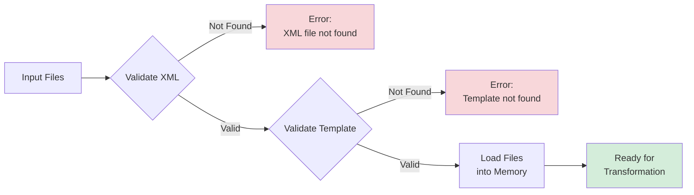

**Process**:
```javascript
// Validate inputs
if (!fs.existsSync(xmlPath)) {
    throw new Error(`XML file not found: ${xmlPath}`);
}
if (!fs.existsSync(templatePath)) {
    throw new Error(`Template file not found: ${templatePath}`);
}

// Load files
const xmlContent = fs.readFileSync(xmlPath, 'utf8');
const templateContent = fs.readFileSync(templatePath, 'utf8');
```

**Files**:
- Input: `xml/document.xml`, `template/document.tex.xml`
- Output: File contents in memory

---

### Stage 2: XML → TeX Transformation

**Module**: `engine.js`

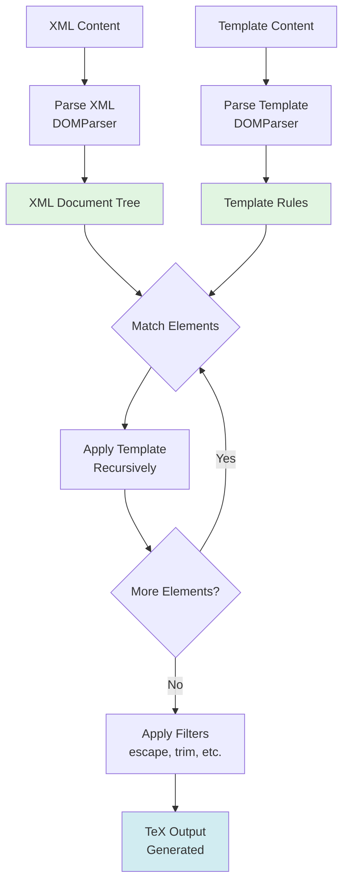

**Process**:
```javascript
// 1. Parse XML
const xmlDoc = new DOMParser().parseFromString(xmlContent, 'text/xml');

// 2. Load template
const templateDoc = new DOMParser().parseFromString(templateContent, 'text/xml');

// 3. Parse selectors from template
const templates = Array.from(templateDoc.getElementsByTagName('template'));
const parsedTemplates = templates.map(t => ({
    match: t.getAttribute('match'), // CSS selector
    content: t.childNodes
}));

// 4. Apply templates recursively
function applyTemplates(node) {
    // Find matching template
    const template = findMatchingTemplate(node, parsedTemplates);
    if (template) {
        return processTemplate(template, node);
    }
    // Process children
    return Array.from(node.childNodes).map(child => applyTemplates(child)).join('');
}

// 5. Generate TeX
const texOutput = applyTemplates(xmlDoc.documentElement);
```

**Example Transformation**:

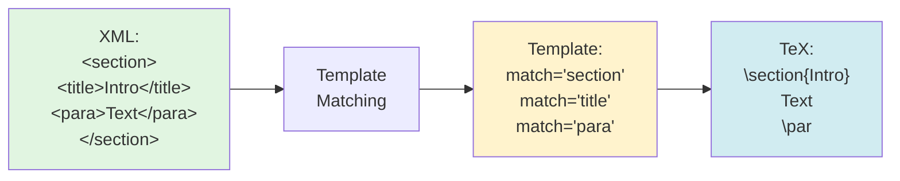

**Output**: `TeX/document-generated.tex`

---

### Stage 3: LaTeX Compilation (3-Pass)

**Module**: `tex-to-pdf.js`

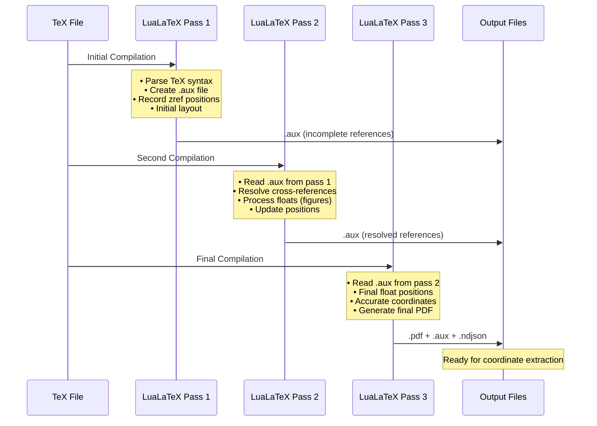

**Why 3 Passes?**
- **Pass 1**: Initial compilation, creates .aux file
- **Pass 2**: Resolves references, processes floats
- **Pass 3**: Final positioning (critical for float coordinates)

**Process**:
```javascript
async function compilePDF(texFile) {
    const texPath = path.resolve(texFile);
    const texDir = path.dirname(texPath);
    const texName = path.basename(texPath, '.tex');
    
    // Pass 1
    await execLatex(texPath, texDir);
    console.log('✓ Pass 1 complete');
    
    // Pass 2
    await execLatex(texPath, texDir);
    console.log('✓ Pass 2 complete');
    
    // Pass 3 (final)
    await execLatex(texPath, texDir);
    console.log('✓ Pass 3 complete');
    
    return path.join(texDir, `${texName}.pdf`);
}

function execLatex(texPath, workingDir) {
    return new Promise((resolve, reject) => {
        const process = spawn('lualatex', [
            '-interaction=nonstopmode',
            '-output-directory=' + workingDir,
            texPath
        ]);
        
        // Emit output in real-time
        process.stdout.on('data', (data) => {
            emitOutput('stdout', data.toString());
        });
        
        process.on('close', (code) => {
            if (code === 0) resolve();
            else reject(new Error(`LaTeX exited with code ${code}`));
        });
    });
}
```

**Coordinate Markers**:
```tex
% Automatically inserted by template
\saveTextPos{para-1}{start}
This is a paragraph.
\saveTextPos{para-1}{end}
```

**Generated Files**:
- `document-generated.pdf` - Final PDF
- `document-generated.aux` - Contains zref coordinate data
- `document-generated-texpos.ndjson` - Extracted coordinates
- `document-generated.log` - Compilation log

---

### Stage 4: Coordinate Extraction

**Module**: `pdf-geometry.js`

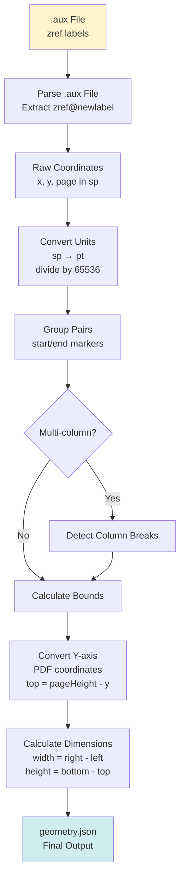

**Process**:
```javascript
// 1. Parse .aux file
const auxContent = fs.readFileSync(auxFile, 'utf8');
const zrefPattern = /\\zref@newlabel\{([^}]+)\}/g;
const coordinates = [];

let match;
while ((match = zrefPattern.exec(auxContent)) !== null) {
    // Extract posx, posy, page from zref label
    coordinates.push({
        id: extractId(match[1]),
        page: extractPage(match[1]),
        x: extractX(match[1]) / 65536, // sp to pt
        y: extractY(match[1]) / 65536
    });
}

// 2. Process start/end pairs
const elements = groupByElement(coordinates);

// 3. Calculate bounding boxes
const geometry = {};
for (const [id, elem] of Object.entries(elements)) {
    if (elem.start && elem.end) {
        const pageHeight = 792; // Letter size
        
        geometry[id] = {
            page: elem.start.page,
            bounds: {
                left: Math.min(elem.start.x, elem.end.x),
                right: Math.max(elem.start.x, elem.end.x),
                top: pageHeight - Math.max(elem.start.y, elem.end.y),
                bottom: pageHeight - Math.min(elem.start.y, elem.end.y),
                width: Math.abs(elem.end.x - elem.start.x),
                height: Math.abs(elem.end.y - elem.start.y)
            }
        };
    }
}

// 4. Write geometry JSON
fs.writeFileSync(geometryFile, JSON.stringify(geometry, null, 2));
```

**Coordinate Transformation**:

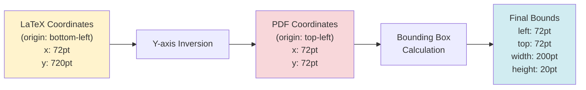

**Output**: `TeX/document-generated-geometry.json`

---

### Stage 5: Output Delivery

**Module**: `server.js` (via WebSocket)

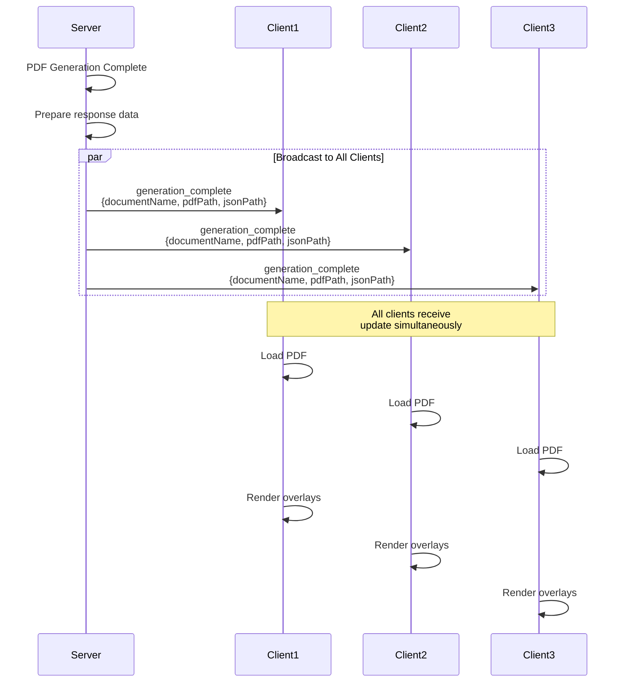

**Process**:
```javascript
// Broadcast completion to all WebSocket clients
broadcastToAllClients({
    type: 'generation_complete',
    documentName: 'document',
    pdfPath: '/path/to/ui/document-generated.pdf',
    jsonPath: '/path/to/ui/document-generated-marked-boxes.json'
});
```

---

## ⏱️ Performance Metrics

### Typical Timing (Medium Document)

```mermaid
gantt
    title PDF Generation Timeline (~8 seconds)
    dateFormat  X
    axisFormat %L ms
    
    section Transformation
    XML Parsing           :a1, 0, 10
    Template Loading      :a2, 10, 5
    Transformation        :a3, 15, 100
    
    section LaTeX
    LaTeX Pass 1          :b1, 115, 2000
    LaTeX Pass 2          :b2, after b1, 2000
    LaTeX Pass 3          :b3, after b2, 2000
    
    section Extraction
    Coordinate Extract    :c1, after b3, 100
    
    section Output
    File Writing          :d1, after c1, 50
```

| Stage | Duration | Bottleneck |
|-------|----------|------------|
| XML Parsing | 10ms | DOM parsing |
| Template Loading | 5ms | File I/O |
| Transformation | 50-100ms | Recursive matching |
| LaTeX Pass 1 | 1-2s | LaTeX engine |
| LaTeX Pass 2 | 1-2s | Reference resolution |
| LaTeX Pass 3 | 1-2s | Final positioning |
| Coordinate Extract | 50-100ms | File parsing |
| **Total** | **5-10s** | LaTeX compilation |

### Optimization Strategies

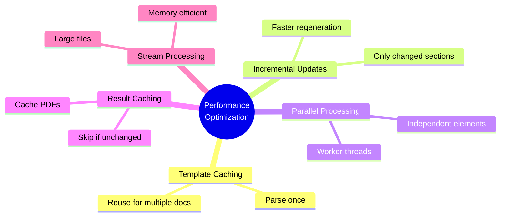

1. **Template Caching**: Cache parsed templates
2. **Incremental Updates**: Only recompile changed sections
3. **Parallel Processing**: Process independent elements in parallel
4. **Result Caching**: Cache PDFs for unchanged inputs

---

## 🐛 Error Handling

### Common Failures

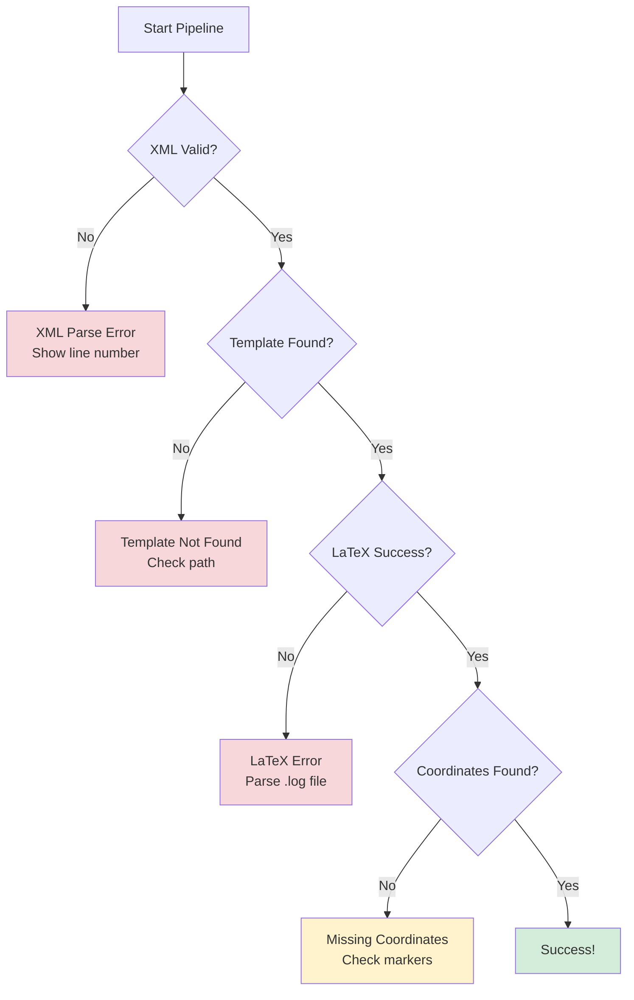

#### 1. XML Parse Error
```javascript
try {
    const xmlDoc = parser.parseFromString(xmlContent);
} catch (error) {
    throw new Error(`XML parsing failed: ${error.message}`);
}
```

#### 2. Template Not Found
```javascript
if (!fs.existsSync(templatePath)) {
    throw new Error(`Template not found: ${templatePath}`);
}
```

#### 3. LaTeX Compilation Error
```javascript
// Check exit code
if (exitCode !== 0) {
    // Parse log for error
    const logContent = fs.readFileSync(logFile, 'utf8');
    const errorMatch = logContent.match(/^! (.*)$/m);
    throw new Error(`LaTeX error: ${errorMatch[1]}`);
}
```

#### 4. Missing Coordinates
```javascript
// Verify all elements have coordinates
const missingCoords = elementIds.filter(id => !geometry[id]);
if (missingCoords.length > 0) {
    console.warn('Missing coordinates for:', missingCoords);
}
```

---

## 🔧 Extending the Pipeline

### Add Pre-Processing Step

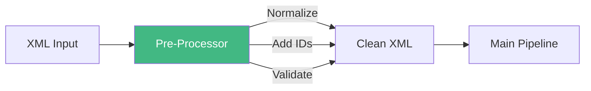

```javascript
// Before transformation
function preprocessXML(xmlDoc) {
    // Normalize whitespace
    // Add IDs to elements
    // Validate structure
    return xmlDoc;
}
```

### Add Post-Processing Step

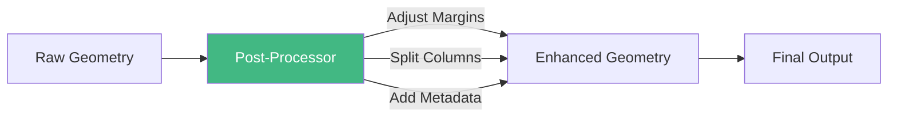

```javascript
// After coordinate extraction
function postprocessGeometry(geometry) {
    // Adjust for margins
    // Split multi-column elements
    // Calculate additional properties
    return geometry;
}
```

### Custom LaTeX Packages
```tex
% In template preamble
\usepackage{myCustomPackage}
\usepackage{anotherPackage}
```

---

## 📚 Related Documentation

- [Engine Module](../modules/ENGINE.md)
- [PDF Geometry Module](../modules/PDF-GEOMETRY.md)
- [Server Module](../modules/SERVER.md)
- [Architecture Overview](../ARCHITECTURE.md)

---

**Last Updated**: November 3, 2025
